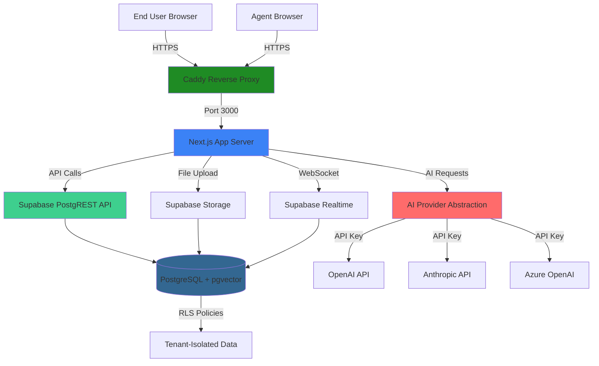
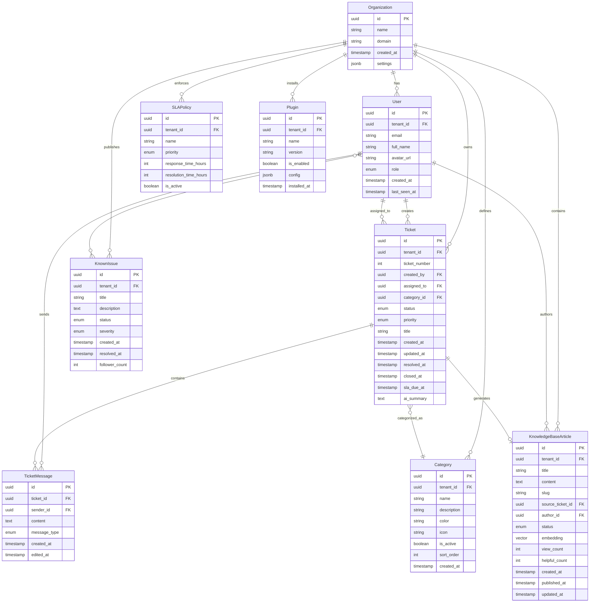

# EasyPing Fullstack Architecture Document

**Product:** EasyPing.me (Community Edition)
**Version:** 0.1
**Status:** Draft - In Progress
**Last Updated:** 2025-01-21

---

## Introduction

This document outlines the complete fullstack architecture for **EasyPing**, including backend systems, frontend implementation, and their integration. It serves as the single source of truth for AI-driven development, ensuring consistency across the entire technology stack.

This unified approach combines what would traditionally be separate backend and frontend architecture documents, streamlining the development process for modern fullstack applications where these concerns are increasingly intertwined.

**EasyPing Context:**

EasyPing is an open-core (AGPLv3), AI-native service desk built as a chat-first alternative to traditional ticketing systems. The architecture must support:
- Single-tenant self-hosted deployment via Docker Compose
- Multi-tenant database schema (future-ready for ServicePing.me SaaS)
- Plugin extensibility with UI components, actions, and background jobs
- AI provider abstraction (OpenAI, Anthropic, Azure) with BYOK (Bring Your Own Key)
- Realtime updates via WebSockets (Supabase Realtime)

### Starter Template or Existing Project

**Status:** N/A - Greenfield project

This is a greenfield project with well-defined technology choices specified in the PRD. While no existing starter template is being used, the architecture follows industry best practices from:
- T3 Stack principles (TypeScript, Next.js, Tailwind CSS)
- Turborepo patterns for monorepo organization
- Supabase Next.js reference architectures for authentication

**Rationale:** Building from scratch provides maximum flexibility for the open-core model and plugin architecture requirements, which would be constrained by opinionated starter templates.

### Change Log

| Date | Version | Description | Author |
|------|---------|-------------|--------|
| 2025-01-21 | 0.1 | Initial architecture draft from PRD v1.0 | Winston (Architect) |

---

## High Level Architecture

### Technical Summary

EasyPing is built as a **serverless monolith** using Next.js 14+ (App Router) with Supabase Backend-as-a-Service (BaaS) for database, authentication, storage, and realtime functionality. The architecture follows a **monorepo pattern** organized with Turborepo and pnpm workspaces, enabling code sharing between frontend components, shared types, AI providers, and database migrations.

The system deploys as a **single Docker Compose stack** for self-hosted installations (EasyPing community edition), bundling the Next.js application with self-hosted Supabase services. The database schema is **multi-tenant ready** with `tenant_id` columns and Row Level Security (RLS) policies, but runs in **single-tenant mode** for community deployments. This design enables seamless migration to the future **ServicePing.me SaaS platform** without database refactoring.

AI capabilities are abstracted through a **provider-agnostic interface** supporting OpenAI, Anthropic, and Azure OpenAI, with users bringing their own API keys (BYOK model). The frontend uses **shadcn/ui** components with Tailwind CSS for a modern, accessible chat-first interface. Realtime updates leverage **Supabase Realtime** (WebSocket subscriptions) for live ticket conversation threading. The plugin framework enables extensibility through UI extension points, webhook-based actions, and background jobs.

This architecture balances **speed to market** (leveraging Supabase BaaS), **self-hostability** (Docker Compose), **future SaaS scalability** (multi-tenant schema), and **open-core business model** (clear separation between community and proprietary features).

### Platform and Infrastructure Choice

**Selected Platform:** Self-Hosted Docker Compose (MVP) with Cloud-Ready Architecture

**Key Services:**
- **Compute:** Docker containers (Next.js app + Supabase stack)
- **Database:** PostgreSQL 15+ with pgvector extension (via Supabase)
- **Authentication:** Supabase Auth (email/password + OAuth providers)
- **Storage:** Supabase Storage (S3-compatible object storage)
- **Realtime:** Supabase Realtime (WebSocket subscriptions)
- **Reverse Proxy:** Caddy (automatic HTTPS, simple configuration)
- **Container Registry:** Docker Hub (public images)

**Deployment Host and Regions:**
- **MVP/Community Edition:** Self-hosted on user infrastructure (Ubuntu 22.04+ recommended)
- **Future ServicePing.me:** Cloud deployment (Vercel for Next.js frontend, Supabase Cloud for backend, multi-region support)

**Rationale:**

Docker Compose provides the simplest self-hosted deployment experience while maintaining architectural patterns that scale to cloud SaaS. Supabase BaaS eliminates the need to build custom auth, storage, and realtime infrastructure, accelerating development by 2-3 months. The stack supports both self-hosted (community) and cloud (SaaS) deployment modes without code changes.

**Alternative Considered:**
- **AWS Full Stack (ECS + RDS + Cognito):** More complex, higher operational overhead, slower development
- **Kubernetes:** Over-engineered for MVP self-hosted deployments, adds complexity
- **Serverless (Vercel + Planetscale):** Less self-hostable, higher vendor lock-in

### Repository Structure

**Structure:** Monorepo with pnpm workspaces + Turborepo

**Package Organization:**
```
easyping/
├── apps/
│   └── web/              # Next.js 14+ frontend application
├── packages/
│   ├── database/         # Supabase migrations, schemas, RLS policies
│   ├── ai/               # AI provider abstraction layer
│   ├── ui/               # Shared UI components (shadcn/ui wrappers)
│   └── types/            # Shared TypeScript types and interfaces
├── docker/
│   └── docker-compose.yml  # Self-hosted deployment stack
└── scripts/              # Build, migration, and deployment scripts
```

**Monorepo Tool:** Turborepo with pnpm workspaces

**Rationale:**
- **Code sharing:** Types, utilities, and UI components shared between frontend and future services
- **Atomic versioning:** All packages versioned together, simplifying releases
- **Developer experience:** Single clone, single install, unified build process
- **Turborepo caching:** Speeds up builds by caching unchanged packages
- **Community friendly:** Contributors work in one repository with clear structure

### High Level Architecture Diagram



**Component Descriptions:**
- **Caddy:** Handles HTTPS termination, routing to Next.js app
- **Next.js App:** Server-side rendering, API routes, client-side React
- **Supabase PostgREST:** Auto-generated REST API from database schema
- **PostgreSQL:** Multi-tenant database with RLS policies, pgvector for embeddings
- **Supabase Realtime:** WebSocket server for live ticket updates
- **Supabase Storage:** S3-compatible object storage for file attachments
- **AI Provider Abstraction:** Unified interface for multiple AI providers (OpenAI, Anthropic, Azure)

### Architectural Patterns

- **Jamstack Architecture:** Static site generation with serverless APIs - _Rationale:_ Next.js App Router enables hybrid SSR/SSG for optimal performance and SEO
- **Backend-as-a-Service (BaaS):** Leverage Supabase for auth, database, storage, realtime - _Rationale:_ Eliminates months of backend development, focuses effort on core features
- **Multi-Tenant Single-Instance:** Database schema supports multi-tenancy but deploys as single tenant - _Rationale:_ Enables future SaaS migration without database refactoring
- **Repository Pattern:** Abstract data access through typed interfaces - _Rationale:_ Enables testing with mocked data, potential future database migration
- **Provider Pattern:** AI abstraction layer with swappable implementations - _Rationale:_ Supports multiple AI providers, graceful degradation when unavailable
- **Plugin Architecture:** Event-driven webhooks with UI extension points - _Rationale:_ Community can extend functionality without forking core code
- **API Gateway Pattern:** Next.js API routes as single entry point - _Rationale:_ Centralized auth, rate limiting, and error handling
- **Component-Based UI:** Reusable React components with TypeScript - _Rationale:_ Maintainability and type safety across large codebase
- **Optimistic UI Updates:** Update UI immediately, sync with server - _Rationale:_ Chat-first UX requires instant feedback for messages
- **Realtime Subscriptions:** WebSocket-based live updates via Supabase - _Rationale:_ Ticket conversations feel like live chat (Slack-style experience)

---

## Tech Stack

This is the **definitive technology selection** for EasyPing. All development must use these exact technologies and versions.

### Technology Stack Table

| Category | Technology | Version | Purpose | Rationale |
|----------|-----------|---------|---------|-----------|
| **Frontend Language** | TypeScript | 5.3+ | Type-safe JavaScript for frontend | Industry standard for large codebases, catches errors at compile time, excellent IDE support |
| **Frontend Framework** | Next.js | 14+ (App Router) | React framework with SSR/SSG | Modern App Router, built-in optimization, excellent DX, Vercel deployment ready |
| **UI Component Library** | shadcn/ui + Radix UI | Latest | Accessible component primitives | Unstyled, accessible components with full customization, no runtime JS overhead |
| **State Management** | React Hooks + Zustand | Zustand 4.4+ | Global state management | Lightweight, simple API, avoids Redux complexity, sufficient for MVP scope |
| **Backend Language** | TypeScript | 5.3+ | Type-safe server-side code | Shared types between frontend/backend, single language across stack |
| **Backend Framework** | Supabase BaaS | Latest | Database, auth, storage, realtime | Eliminates custom backend development, self-hostable, production-ready |
| **API Style** | REST (Supabase PostgREST) + Next.js API Routes | N/A | Auto-generated REST API + custom endpoints | PostgREST provides instant CRUD, Next.js routes for AI/plugin logic |
| **Database** | PostgreSQL | 15+ | Relational database with pgvector | Industry standard, RLS support, pgvector for embeddings, Supabase-managed |
| **Cache** | None (MVP) | N/A | Caching layer | Defer to post-MVP, PostgreSQL query performance sufficient initially |
| **File Storage** | Supabase Storage | Latest | Object storage for attachments | S3-compatible, integrated with Supabase auth, simple upload/download APIs |
| **Authentication** | Supabase Auth | Latest | User authentication + OAuth | Built-in email/password, social OAuth (Google), JWT tokens, secure session management |
| **Frontend Testing** | Vitest | Latest | Fast unit testing framework | Vite-compatible, faster than Jest, modern API, excellent TypeScript support |
| **Backend Testing** | Vitest | Latest | Backend unit tests | Same framework as frontend for consistency, mocks Supabase client |
| **E2E Testing** | Playwright | Latest | End-to-end testing | Cross-browser support, reliable, excellent debugging tools |
| **Build Tool** | Turborepo | Latest | Monorepo task orchestration | Intelligent caching, parallel execution, simple configuration |
| **Package Manager** | pnpm | 8.0+ | Fast, efficient package management | Workspace support, faster than npm/yarn, efficient disk usage |
| **Bundler** | Next.js Built-in (Turbopack) | N/A | JavaScript bundler | Next.js 14+ uses Turbopack, faster than Webpack, zero config needed |
| **IaC Tool** | Docker Compose | Latest | Infrastructure as code | Simple YAML config, single-command deployment, portable across environments |
| **CI/CD** | GitHub Actions | N/A | Continuous integration/deployment | Free for open source, integrated with GitHub, simple workflow YAML |
| **Monitoring** | None (MVP) | N/A | Application monitoring | Defer to post-MVP, rely on Docker logs initially |
| **Logging** | Console + Docker Logs | N/A | Application logging | Built-in logging sufficient for MVP, structured logs via Next.js |
| **CSS Framework** | Tailwind CSS | 3.4+ | Utility-first CSS framework | Rapid styling, excellent DX, purges unused CSS, shadcn/ui compatible |
| **Forms** | React Hook Form + Zod | Latest | Form validation | Performant, minimal re-renders, Zod provides TypeScript-first schema validation |
| **Icons** | Lucide React | Latest | Icon library | Modern, consistent, tree-shakeable, excellent Next.js support |
| **Date/Time** | date-fns | 3.0+ | Date manipulation library | Lightweight, immutable, modular, simpler than Moment.js |
| **AI Providers** | OpenAI SDK, Anthropic SDK, Azure OpenAI | Latest | AI provider integration | Official SDKs for categorization, summarization, embeddings |
| **Vector Search** | pgvector (PostgreSQL extension) | 0.5+ | Semantic search via embeddings | Native PostgreSQL extension, no separate vector DB needed |

**Additional Development Tools:**
- **Linting:** ESLint + Prettier (enforced via Husky pre-commit hooks)
- **Git Hooks:** Husky + lint-staged (runs lint and type-check before commit)
- **Versioning:** Semantic versioning (semver) for releases
- **Container Registry:** Docker Hub (public images for community downloads)

---

## Data Models

These are the core data models/entities shared between frontend and backend. All TypeScript interfaces are defined in `packages/types` and imported throughout the application.

### Entity Relationship Diagram



**Diagram Notes:**
- **All tables include `tenant_id`** (except Organization) for multi-tenant isolation
- **Primary keys (PK)** are all UUIDs for distributed system compatibility
- **Foreign keys (FK)** enforce referential integrity
- **RLS policies** (not shown in diagram) enforce tenant isolation at database level
- **Vector column** in KnowledgeBaseArticle uses pgvector extension for semantic search
- **JSONB columns** (settings, config) provide schema flexibility for extensibility
- **Many-to-many relationships** (User ↔ KnownIssue followers) require join table (not shown for clarity)

---

### Organization

**Purpose:** Represents a tenant (organization/company) in the multi-tenant schema. EasyPing runs in single-tenant mode (one org per deployment), while ServicePing.me supports multiple organizations.

**Key Attributes:**
- `id`: UUID - Unique identifier (primary key)
- `name`: string - Organization name (e.g., "Acme Corp IT")
- `domain`: string | null - Organization domain for email matching (e.g., "acme.com")
- `created_at`: Date - Timestamp of organization creation
- `settings`: OrganizationSettings - JSON object with configuration (branding, AI provider config, SLA policies)

#### TypeScript Interface

```typescript
interface Organization {
  id: string; // UUID
  name: string;
  domain: string | null;
  created_at: Date;
  settings: OrganizationSettings;
}

interface OrganizationSettings {
  branding?: {
    logo_url?: string;
    primary_color?: string;
    company_name?: string;
  };
  ai_provider?: {
    provider: 'openai' | 'anthropic' | 'azure';
    api_key_encrypted: string;
    model: string; // e.g., "gpt-3.5-turbo", "claude-2"
    embeddings_model?: string;
  };
  features?: {
    auto_archive_days: number; // Default: 90
    max_file_size_mb: number; // Default: 10
  };
}
```

#### Relationships

- One-to-many with `User` (one organization has many users)
- One-to-many with `Ticket` (one organization has many tickets)
- One-to-many with `Category` (one organization has many categories)
- One-to-many with `KnowledgeBaseArticle` (one organization has many KB articles)
- One-to-many with `SLAPolicy` (one organization has many SLA policies)

---

### User

**Purpose:** Represents a user account (end user, agent, manager, or owner) with role-based access control.

**Key Attributes:**
- `id`: UUID - Unique identifier (Supabase Auth user ID)
- `tenant_id`: UUID - Foreign key to `Organization`
- `email`: string - User email (unique per organization)
- `full_name`: string - Display name
- `avatar_url`: string | null - Profile picture URL (Supabase Storage)
- `role`: UserRole - One of: 'end_user', 'agent', 'manager', 'owner'
- `created_at`: Date - Account creation timestamp
- `last_seen_at`: Date | null - Last activity timestamp

#### TypeScript Interface

```typescript
enum UserRole {
  END_USER = 'end_user',
  AGENT = 'agent',
  MANAGER = 'manager',
  OWNER = 'owner'
}

interface User {
  id: string; // UUID (Supabase Auth ID)
  tenant_id: string; // UUID
  email: string;
  full_name: string;
  avatar_url: string | null;
  role: UserRole;
  created_at: Date;
  last_seen_at: Date | null;
}
```

#### Relationships

- Many-to-one with `Organization` (many users belong to one organization)
- One-to-many with `Ticket` as creator (user creates many tickets)
- One-to-many with `Ticket` as assignee (agent assigned to many tickets)
- One-to-many with `TicketMessage` (user sends many messages)

---

### Ticket

**Purpose:** Represents a support ticket (ping) with conversational threading, status tracking, and metadata.

**Key Attributes:**
- `id`: UUID - Unique identifier
- `tenant_id`: UUID - Foreign key to `Organization`
- `ticket_number`: number - Auto-incrementing display ID (e.g., #PING-001)
- `created_by`: UUID - Foreign key to `User` (ticket creator)
- `assigned_to`: UUID | null - Foreign key to `User` (assigned agent)
- `category_id`: UUID | null - Foreign key to `Category`
- `status`: TicketStatus - Current ticket state
- `priority`: TicketPriority - Urgency level
- `title`: string - Extracted from first message (AI-generated or user-provided)
- `created_at`: Date - Ticket creation timestamp
- `updated_at`: Date - Last update timestamp
- `resolved_at`: Date | null - Resolution timestamp
- `closed_at`: Date | null - Closure timestamp
- `sla_due_at`: Date | null - SLA deadline
- `ai_summary`: string | null - AI-generated ticket summary

#### TypeScript Interface

```typescript
enum TicketStatus {
  NEW = 'new',
  IN_PROGRESS = 'in_progress',
  WAITING_ON_USER = 'waiting_on_user',
  RESOLVED = 'resolved',
  CLOSED = 'closed'
}

enum TicketPriority {
  LOW = 'low',
  NORMAL = 'normal',
  HIGH = 'high',
  URGENT = 'urgent'
}

interface Ticket {
  id: string; // UUID
  tenant_id: string; // UUID
  ticket_number: number;
  created_by: string; // UUID (User ID)
  assigned_to: string | null; // UUID (User ID)
  category_id: string | null; // UUID (Category ID)
  status: TicketStatus;
  priority: TicketPriority;
  title: string;
  created_at: Date;
  updated_at: Date;
  resolved_at: Date | null;
  closed_at: Date | null;
  sla_due_at: Date | null;
  ai_summary: string | null;
}
```

#### Relationships

- Many-to-one with `Organization` (many tickets belong to one organization)
- Many-to-one with `User` as creator
- Many-to-one with `User` as assignee (optional)
- Many-to-one with `Category` (optional)
- One-to-many with `TicketMessage` (one ticket has many messages)
- One-to-many with `TicketAttachment` (one ticket has many attachments)

---

### TicketMessage

**Purpose:** Represents a single message in a ticket conversation thread (from user or agent).

**Key Attributes:**
- `id`: UUID - Unique identifier
- `ticket_id`: UUID - Foreign key to `Ticket`
- `sender_id`: UUID - Foreign key to `User`
- `content`: string - Message text content
- `message_type`: MessageType - 'user', 'agent', or 'system'
- `created_at`: Date - Message timestamp
- `edited_at`: Date | null - Last edit timestamp

#### TypeScript Interface

```typescript
enum MessageType {
  USER = 'user',
  AGENT = 'agent',
  SYSTEM = 'system' // e.g., "Agent changed status to Resolved"
}

interface TicketMessage {
  id: string; // UUID
  ticket_id: string; // UUID
  sender_id: string; // UUID (User ID)
  content: string;
  message_type: MessageType;
  created_at: Date;
  edited_at: Date | null;
}
```

#### Relationships

- Many-to-one with `Ticket` (many messages belong to one ticket)
- Many-to-one with `User` as sender
- One-to-many with `MessageAttachment` (one message can have multiple attachments)

---

### Category

**Purpose:** Ticket categories for routing and organization (e.g., Hardware, Software, Access Request, Network).

**Key Attributes:**
- `id`: UUID - Unique identifier
- `tenant_id`: UUID - Foreign key to `Organization`
- `name`: string - Category name (e.g., "Hardware")
- `description`: string | null - Category description
- `color`: string - Badge color (hex code)
- `icon`: string | null - Icon identifier (Lucide icon name)
- `is_active`: boolean - Whether category is active (can be archived)
- `sort_order`: number - Display order
- `created_at`: Date - Creation timestamp

#### TypeScript Interface

```typescript
interface Category {
  id: string; // UUID
  tenant_id: string; // UUID
  name: string;
  description: string | null;
  color: string; // Hex color code (e.g., "#3b82f6")
  icon: string | null; // Lucide icon name (e.g., "Wrench")
  is_active: boolean;
  sort_order: number;
  created_at: Date;
}
```

#### Relationships

- Many-to-one with `Organization` (many categories belong to one organization)
- One-to-many with `Ticket` (one category applies to many tickets)
- One-to-many with `RoutingRule` (one category has many routing rules)

---

### KnowledgeBaseArticle

**Purpose:** Represents a knowledge base article for self-service support, generated from resolved tickets or manually created.

**Key Attributes:**
- `id`: UUID - Unique identifier
- `tenant_id`: UUID - Foreign key to `Organization`
- `title`: string - Article title
- `content`: string - Markdown content
- `slug`: string - URL-friendly slug
- `source_ticket_id`: UUID | null - Foreign key to original `Ticket` (if auto-generated)
- `author_id`: UUID - Foreign key to `User` (agent who published)
- `status`: ArticleStatus - 'draft', 'published', 'archived'
- `embedding`: number[] | null - Vector embedding for semantic search (pgvector)
- `view_count`: number - Number of times viewed
- `helpful_count`: number - Upvote count
- `created_at`: Date - Creation timestamp
- `published_at`: Date | null - Publication timestamp
- `updated_at`: Date - Last update timestamp

#### TypeScript Interface

```typescript
enum ArticleStatus {
  DRAFT = 'draft',
  PUBLISHED = 'published',
  ARCHIVED = 'archived'
}

interface KnowledgeBaseArticle {
  id: string; // UUID
  tenant_id: string; // UUID
  title: string;
  content: string; // Markdown
  slug: string;
  source_ticket_id: string | null; // UUID
  author_id: string; // UUID (User ID)
  status: ArticleStatus;
  embedding: number[] | null; // pgvector embedding
  view_count: number;
  helpful_count: number;
  created_at: Date;
  published_at: Date | null;
  updated_at: Date;
}
```

#### Relationships

- Many-to-one with `Organization` (many articles belong to one organization)
- Many-to-one with `User` as author
- Many-to-one with `Ticket` as source (optional)

---

### SLAPolicy

**Purpose:** Defines service level agreement policies with response and resolution time targets.

**Key Attributes:**
- `id`: UUID - Unique identifier
- `tenant_id`: UUID - Foreign key to `Organization`
- `name`: string - Policy name (e.g., "Standard Support")
- `priority`: TicketPriority - Applies to tickets with this priority
- `response_time_hours`: number - Target time for first response (in hours)
- `resolution_time_hours`: number - Target time for resolution (in hours)
- `is_active`: boolean - Whether policy is currently active

#### TypeScript Interface

```typescript
interface SLAPolicy {
  id: string; // UUID
  tenant_id: string; // UUID
  name: string;
  priority: TicketPriority;
  response_time_hours: number;
  resolution_time_hours: number;
  is_active: boolean;
}
```

#### Relationships

- Many-to-one with `Organization` (many SLA policies belong to one organization)

---

### Plugin

**Purpose:** Represents an installed plugin with configuration and metadata.

**Key Attributes:**
- `id`: UUID - Unique identifier
- `tenant_id`: UUID - Foreign key to `Organization`
- `name`: string - Plugin name (e.g., "system-uptime-monitor")
- `version`: string - Installed version (semver)
- `is_enabled`: boolean - Whether plugin is active
- `config`: PluginConfig - JSON configuration object
- `installed_at`: Date - Installation timestamp

#### TypeScript Interface

```typescript
interface Plugin {
  id: string; // UUID
  tenant_id: string; // UUID
  name: string;
  version: string;
  is_enabled: boolean;
  config: PluginConfig; // JSON object, plugin-specific
  installed_at: Date;
}

interface PluginConfig {
  [key: string]: any; // Plugin-specific configuration
}
```

#### Relationships

- Many-to-one with `Organization` (many plugins belong to one organization)

---

### KnownIssue

**Purpose:** Represents a publicly visible known issue (outage, incident) that users can follow instead of creating duplicate tickets.

**Key Attributes:**
- `id`: UUID - Unique identifier
- `tenant_id`: UUID - Foreign key to `Organization`
- `title`: string - Issue title (e.g., "Email Server Outage")
- `description`: string - Issue description (Markdown)
- `status`: IssueStatus - 'investigating', 'identified', 'monitoring', 'resolved'
- `severity`: IssueSeverity - 'low', 'medium', 'high', 'critical'
- `created_at`: Date - Creation timestamp
- `resolved_at`: Date | null - Resolution timestamp
- `follower_count`: number - Number of users following

#### TypeScript Interface

```typescript
enum IssueStatus {
  INVESTIGATING = 'investigating',
  IDENTIFIED = 'identified',
  MONITORING = 'monitoring',
  RESOLVED = 'resolved'
}

enum IssueSeverity {
  LOW = 'low',
  MEDIUM = 'medium',
  HIGH = 'high',
  CRITICAL = 'critical'
}

interface KnownIssue {
  id: string; // UUID
  tenant_id: string; // UUID
  title: string;
  description: string; // Markdown
  status: IssueStatus;
  severity: IssueSeverity;
  created_at: Date;
  resolved_at: Date | null;
  follower_count: number;
}
```

#### Relationships

- Many-to-one with `Organization` (many known issues belong to one organization)
- Many-to-many with `User` (followers tracking issue updates)

---

## Database Schema

This section defines the concrete PostgreSQL schema with Row Level Security (RLS) policies for multi-tenant isolation. All migrations are managed via Supabase CLI in the `packages/database/migrations` directory.

### Extensions and Setup

```sql
-- Enable required PostgreSQL extensions
CREATE EXTENSION IF NOT EXISTS "uuid-ossp";      -- UUID generation
CREATE EXTENSION IF NOT EXISTS "pgcrypto";       -- Encryption functions
CREATE EXTENSION IF NOT EXISTS "vector";         -- pgvector for embeddings

-- Enable Row Level Security on all tables (enforced below)
```

### Core Tables

#### Organizations Table

```sql
CREATE TABLE organizations (
  id UUID PRIMARY KEY DEFAULT uuid_generate_v4(),
  name TEXT NOT NULL,
  domain TEXT,
  created_at TIMESTAMPTZ NOT NULL DEFAULT NOW(),
  settings JSONB DEFAULT '{}'::JSONB,

  CONSTRAINT organizations_name_not_empty CHECK (length(trim(name)) > 0)
);

CREATE INDEX idx_organizations_domain ON organizations(domain) WHERE domain IS NOT NULL;

-- No RLS on organizations table (managed by application layer)
```

#### Users Table

```sql
-- Extends Supabase auth.users with application-specific fields
CREATE TABLE users (
  id UUID PRIMARY KEY REFERENCES auth.users(id) ON DELETE CASCADE,
  tenant_id UUID NOT NULL REFERENCES organizations(id) ON DELETE CASCADE,
  email TEXT NOT NULL,
  full_name TEXT NOT NULL,
  avatar_url TEXT,
  role TEXT NOT NULL DEFAULT 'end_user',
  created_at TIMESTAMPTZ NOT NULL DEFAULT NOW(),
  last_seen_at TIMESTAMPTZ,

  CONSTRAINT users_role_valid CHECK (role IN ('end_user', 'agent', 'manager', 'owner')),
  CONSTRAINT users_email_valid CHECK (email ~* '^[A-Za-z0-9._%+-]+@[A-Za-z0-9.-]+\.[A-Za-z]{2,}$')
);

-- Indexes
CREATE INDEX idx_users_tenant_id ON users(tenant_id);
CREATE INDEX idx_users_email ON users(tenant_id, email);
CREATE INDEX idx_users_role ON users(tenant_id, role) WHERE role IN ('agent', 'manager', 'owner');

-- RLS Policies
ALTER TABLE users ENABLE ROW LEVEL SECURITY;

CREATE POLICY tenant_isolation ON users
  USING (tenant_id = current_setting('app.tenant_id', true)::UUID);

CREATE POLICY users_select_own_org ON users
  FOR SELECT
  USING (tenant_id = current_setting('app.tenant_id', true)::UUID);
```

#### Categories Table

```sql
CREATE TABLE categories (
  id UUID PRIMARY KEY DEFAULT uuid_generate_v4(),
  tenant_id UUID NOT NULL REFERENCES organizations(id) ON DELETE CASCADE,
  name TEXT NOT NULL,
  description TEXT,
  color TEXT NOT NULL DEFAULT '#3b82f6',
  icon TEXT,
  is_active BOOLEAN NOT NULL DEFAULT true,
  sort_order INTEGER NOT NULL DEFAULT 0,
  created_at TIMESTAMPTZ NOT NULL DEFAULT NOW(),

  CONSTRAINT categories_name_not_empty CHECK (length(trim(name)) > 0),
  CONSTRAINT categories_color_hex CHECK (color ~* '^#[0-9A-Fa-f]{6}$')
);

-- Indexes
CREATE INDEX idx_categories_tenant_id ON categories(tenant_id);
CREATE INDEX idx_categories_active ON categories(tenant_id, is_active) WHERE is_active = true;
CREATE INDEX idx_categories_sort_order ON categories(tenant_id, sort_order);

-- RLS Policies
ALTER TABLE categories ENABLE ROW LEVEL SECURITY;

CREATE POLICY tenant_isolation ON categories
  USING (tenant_id = current_setting('app.tenant_id', true)::UUID);
```

#### Tickets Table

```sql
CREATE TABLE tickets (
  id UUID PRIMARY KEY DEFAULT uuid_generate_v4(),
  tenant_id UUID NOT NULL REFERENCES organizations(id) ON DELETE CASCADE,
  ticket_number SERIAL NOT NULL,
  created_by UUID NOT NULL REFERENCES users(id) ON DELETE CASCADE,
  assigned_to UUID REFERENCES users(id) ON DELETE SET NULL,
  category_id UUID REFERENCES categories(id) ON DELETE SET NULL,
  status TEXT NOT NULL DEFAULT 'new',
  priority TEXT NOT NULL DEFAULT 'normal',
  title TEXT NOT NULL,
  created_at TIMESTAMPTZ NOT NULL DEFAULT NOW(),
  updated_at TIMESTAMPTZ NOT NULL DEFAULT NOW(),
  resolved_at TIMESTAMPTZ,
  closed_at TIMESTAMPTZ,
  sla_due_at TIMESTAMPTZ,
  ai_summary TEXT,

  CONSTRAINT tickets_status_valid CHECK (status IN ('new', 'in_progress', 'waiting_on_user', 'resolved', 'closed')),
  CONSTRAINT tickets_priority_valid CHECK (priority IN ('low', 'normal', 'high', 'urgent')),
  CONSTRAINT tickets_title_not_empty CHECK (length(trim(title)) > 0)
);

-- Indexes
CREATE INDEX idx_tickets_tenant_id ON tickets(tenant_id);
CREATE INDEX idx_tickets_status ON tickets(tenant_id, status);
CREATE INDEX idx_tickets_created_by ON tickets(tenant_id, created_by);
CREATE INDEX idx_tickets_assigned_to ON tickets(tenant_id, assigned_to) WHERE assigned_to IS NOT NULL;
CREATE INDEX idx_tickets_category ON tickets(tenant_id, category_id) WHERE category_id IS NOT NULL;
CREATE INDEX idx_tickets_created_at ON tickets(tenant_id, created_at DESC);
CREATE INDEX idx_tickets_sla_due ON tickets(tenant_id, sla_due_at) WHERE sla_due_at IS NOT NULL AND status NOT IN ('resolved', 'closed');

-- RLS Policies
ALTER TABLE tickets ENABLE ROW LEVEL SECURITY;

CREATE POLICY tenant_isolation ON tickets
  USING (tenant_id = current_setting('app.tenant_id', true)::UUID);

-- End users can only see their own tickets
CREATE POLICY users_select_own_tickets ON tickets
  FOR SELECT
  USING (
    tenant_id = current_setting('app.tenant_id', true)::UUID
    AND (
      created_by = auth.uid()
      OR EXISTS (
        SELECT 1 FROM users
        WHERE users.id = auth.uid()
        AND users.role IN ('agent', 'manager', 'owner')
      )
    )
  );

-- Auto-update updated_at timestamp
CREATE OR REPLACE FUNCTION update_updated_at_column()
RETURNS TRIGGER AS $$
BEGIN
  NEW.updated_at = NOW();
  RETURN NEW;
END;
$$ LANGUAGE plpgsql;

CREATE TRIGGER update_tickets_updated_at
  BEFORE UPDATE ON tickets
  FOR EACH ROW
  EXECUTE FUNCTION update_updated_at_column();
```

#### Ticket Messages Table

```sql
CREATE TABLE ticket_messages (
  id UUID PRIMARY KEY DEFAULT uuid_generate_v4(),
  ticket_id UUID NOT NULL REFERENCES tickets(id) ON DELETE CASCADE,
  sender_id UUID NOT NULL REFERENCES users(id) ON DELETE CASCADE,
  content TEXT NOT NULL,
  message_type TEXT NOT NULL DEFAULT 'user',
  created_at TIMESTAMPTZ NOT NULL DEFAULT NOW(),
  edited_at TIMESTAMPTZ,

  CONSTRAINT ticket_messages_type_valid CHECK (message_type IN ('user', 'agent', 'system')),
  CONSTRAINT ticket_messages_content_not_empty CHECK (length(trim(content)) > 0)
);

-- Indexes
CREATE INDEX idx_ticket_messages_ticket_id ON ticket_messages(ticket_id, created_at);
CREATE INDEX idx_ticket_messages_sender_id ON ticket_messages(sender_id);

-- RLS Policies
ALTER TABLE ticket_messages ENABLE ROW LEVEL SECURITY;

CREATE POLICY ticket_messages_select ON ticket_messages
  FOR SELECT
  USING (
    EXISTS (
      SELECT 1 FROM tickets
      WHERE tickets.id = ticket_messages.ticket_id
      AND tickets.tenant_id = current_setting('app.tenant_id', true)::UUID
    )
  );
```

#### Knowledge Base Articles Table

```sql
CREATE TABLE knowledge_base_articles (
  id UUID PRIMARY KEY DEFAULT uuid_generate_v4(),
  tenant_id UUID NOT NULL REFERENCES organizations(id) ON DELETE CASCADE,
  title TEXT NOT NULL,
  content TEXT NOT NULL,
  slug TEXT NOT NULL,
  source_ticket_id UUID REFERENCES tickets(id) ON DELETE SET NULL,
  author_id UUID NOT NULL REFERENCES users(id) ON DELETE CASCADE,
  status TEXT NOT NULL DEFAULT 'draft',
  embedding VECTOR(1536), -- OpenAI text-embedding-3-small dimension
  view_count INTEGER NOT NULL DEFAULT 0,
  helpful_count INTEGER NOT NULL DEFAULT 0,
  created_at TIMESTAMPTZ NOT NULL DEFAULT NOW(),
  published_at TIMESTAMPTZ,
  updated_at TIMESTAMPTZ NOT NULL DEFAULT NOW(),

  CONSTRAINT kb_articles_status_valid CHECK (status IN ('draft', 'published', 'archived')),
  CONSTRAINT kb_articles_title_not_empty CHECK (length(trim(title)) > 0),
  CONSTRAINT kb_articles_slug_format CHECK (slug ~* '^[a-z0-9]+(?:-[a-z0-9]+)*$'),
  UNIQUE (tenant_id, slug)
);

-- Indexes
CREATE INDEX idx_kb_articles_tenant_id ON knowledge_base_articles(tenant_id);
CREATE INDEX idx_kb_articles_status ON knowledge_base_articles(tenant_id, status);
CREATE INDEX idx_kb_articles_author ON knowledge_base_articles(tenant_id, author_id);
CREATE INDEX idx_kb_articles_published ON knowledge_base_articles(tenant_id, published_at DESC) WHERE status = 'published';

-- Vector similarity search index (IVFFlat for speed, adjust lists based on dataset size)
CREATE INDEX idx_kb_articles_embedding ON knowledge_base_articles
  USING ivfflat (embedding vector_cosine_ops)
  WITH (lists = 100);

-- RLS Policies
ALTER TABLE knowledge_base_articles ENABLE ROW LEVEL SECURITY;

CREATE POLICY tenant_isolation ON knowledge_base_articles
  USING (tenant_id = current_setting('app.tenant_id', true)::UUID);

-- Auto-update updated_at timestamp
CREATE TRIGGER update_kb_articles_updated_at
  BEFORE UPDATE ON knowledge_base_articles
  FOR EACH ROW
  EXECUTE FUNCTION update_updated_at_column();
```

#### SLA Policies Table

```sql
CREATE TABLE sla_policies (
  id UUID PRIMARY KEY DEFAULT uuid_generate_v4(),
  tenant_id UUID NOT NULL REFERENCES organizations(id) ON DELETE CASCADE,
  name TEXT NOT NULL,
  priority TEXT NOT NULL,
  response_time_hours INTEGER NOT NULL,
  resolution_time_hours INTEGER NOT NULL,
  is_active BOOLEAN NOT NULL DEFAULT true,

  CONSTRAINT sla_policies_priority_valid CHECK (priority IN ('low', 'normal', 'high', 'urgent')),
  CONSTRAINT sla_policies_response_time_positive CHECK (response_time_hours > 0),
  CONSTRAINT sla_policies_resolution_time_positive CHECK (resolution_time_hours > 0),
  UNIQUE (tenant_id, priority, is_active)
);

-- Indexes
CREATE INDEX idx_sla_policies_tenant_id ON sla_policies(tenant_id);
CREATE INDEX idx_sla_policies_active ON sla_policies(tenant_id, is_active) WHERE is_active = true;

-- RLS Policies
ALTER TABLE sla_policies ENABLE ROW LEVEL SECURITY;

CREATE POLICY tenant_isolation ON sla_policies
  USING (tenant_id = current_setting('app.tenant_id', true)::UUID);
```

#### Plugins Table

```sql
CREATE TABLE plugins (
  id UUID PRIMARY KEY DEFAULT uuid_generate_v4(),
  tenant_id UUID NOT NULL REFERENCES organizations(id) ON DELETE CASCADE,
  name TEXT NOT NULL,
  version TEXT NOT NULL,
  is_enabled BOOLEAN NOT NULL DEFAULT true,
  config JSONB DEFAULT '{}'::JSONB,
  installed_at TIMESTAMPTZ NOT NULL DEFAULT NOW(),

  CONSTRAINT plugins_name_not_empty CHECK (length(trim(name)) > 0),
  CONSTRAINT plugins_version_semver CHECK (version ~* '^\d+\.\d+\.\d+'),
  UNIQUE (tenant_id, name)
);

-- Indexes
CREATE INDEX idx_plugins_tenant_id ON plugins(tenant_id);
CREATE INDEX idx_plugins_enabled ON plugins(tenant_id, is_enabled) WHERE is_enabled = true;

-- RLS Policies
ALTER TABLE plugins ENABLE ROW LEVEL SECURITY;

CREATE POLICY tenant_isolation ON plugins
  USING (tenant_id = current_setting('app.tenant_id', true)::UUID);
```

#### Known Issues Table

```sql
CREATE TABLE known_issues (
  id UUID PRIMARY KEY DEFAULT uuid_generate_v4(),
  tenant_id UUID NOT NULL REFERENCES organizations(id) ON DELETE CASCADE,
  title TEXT NOT NULL,
  description TEXT NOT NULL,
  status TEXT NOT NULL DEFAULT 'investigating',
  severity TEXT NOT NULL DEFAULT 'medium',
  created_at TIMESTAMPTZ NOT NULL DEFAULT NOW(),
  resolved_at TIMESTAMPTZ,
  follower_count INTEGER NOT NULL DEFAULT 0,

  CONSTRAINT known_issues_status_valid CHECK (status IN ('investigating', 'identified', 'monitoring', 'resolved')),
  CONSTRAINT known_issues_severity_valid CHECK (severity IN ('low', 'medium', 'high', 'critical')),
  CONSTRAINT known_issues_title_not_empty CHECK (length(trim(title)) > 0)
);

-- Indexes
CREATE INDEX idx_known_issues_tenant_id ON known_issues(tenant_id);
CREATE INDEX idx_known_issues_status ON known_issues(tenant_id, status);
CREATE INDEX idx_known_issues_severity ON known_issues(tenant_id, severity);
CREATE INDEX idx_known_issues_created ON known_issues(tenant_id, created_at DESC);

-- RLS Policies
ALTER TABLE known_issues ENABLE ROW LEVEL SECURITY;

CREATE POLICY tenant_isolation ON known_issues
  USING (tenant_id = current_setting('app.tenant_id', true)::UUID);
```

### Join Tables

#### Issue Followers (Many-to-Many)

```sql
CREATE TABLE issue_followers (
  issue_id UUID NOT NULL REFERENCES known_issues(id) ON DELETE CASCADE,
  user_id UUID NOT NULL REFERENCES users(id) ON DELETE CASCADE,
  followed_at TIMESTAMPTZ NOT NULL DEFAULT NOW(),

  PRIMARY KEY (issue_id, user_id)
);

-- Indexes
CREATE INDEX idx_issue_followers_user_id ON issue_followers(user_id);
CREATE INDEX idx_issue_followers_issue_id ON issue_followers(issue_id);

-- RLS Policies
ALTER TABLE issue_followers ENABLE ROW LEVEL SECURITY;

CREATE POLICY issue_followers_own_records ON issue_followers
  FOR ALL
  USING (user_id = auth.uid());
```

### Helper Functions

#### Set Tenant Context

```sql
-- Helper function to set tenant context for RLS policies
-- Called by application middleware before database queries
CREATE OR REPLACE FUNCTION set_tenant_context(tenant_uuid UUID)
RETURNS void AS $$
BEGIN
  PERFORM set_config('app.tenant_id', tenant_uuid::TEXT, false);
END;
$$ LANGUAGE plpgsql SECURITY DEFINER;
```

#### Generate Ticket Number

```sql
-- Auto-generate sequential ticket numbers per tenant
CREATE OR REPLACE FUNCTION generate_ticket_number()
RETURNS TRIGGER AS $$
DECLARE
  next_number INTEGER;
BEGIN
  SELECT COALESCE(MAX(ticket_number), 0) + 1
  INTO next_number
  FROM tickets
  WHERE tenant_id = NEW.tenant_id;

  NEW.ticket_number := next_number;
  RETURN NEW;
END;
$$ LANGUAGE plpgsql;

CREATE TRIGGER set_ticket_number
  BEFORE INSERT ON tickets
  FOR EACH ROW
  EXECUTE FUNCTION generate_ticket_number();
```

### Migration Strategy

**Migration Files Location:** `packages/database/migrations/`

**Example Migration Naming:**
- `20250121000001_create_organizations.sql`
- `20250121000002_create_users.sql`
- `20250121000003_create_categories.sql`
- etc.

**Supabase CLI Commands:**
```bash
# Create new migration
supabase migration new <migration_name>

# Apply migrations locally
supabase db reset

# Generate TypeScript types from schema
supabase gen types typescript --local > packages/types/src/supabase.ts

# Apply migrations to remote (production)
supabase db push
```

**Rollback Strategy:**
- Each migration includes `UP` (changes) and `DOWN` (rollback) SQL
- Critical migrations tested on staging before production
- Database backups taken before major schema changes

---

## Unified Project Structure

Complete monorepo structure showing all packages, applications, and configuration files.

```
easyping/
├── .github/                          # GitHub configuration
│   └── workflows/
│       ├── ci.yml                    # Lint, typecheck, test on PR
│       ├── build.yml                 # Build Docker image on merge
│       └── release.yml               # Publish releases to Docker Hub
│
├── apps/
│   └── web/                          # Next.js 14+ frontend application
│       ├── src/
│       │   ├── app/                  # App Router pages
│       │   │   ├── (auth)/           # Auth route group
│       │   │   │   ├── login/
│       │   │   │   ├── signup/
│       │   │   │   └── layout.tsx
│       │   │   ├── (dashboard)/      # Dashboard route group (protected)
│       │   │   │   ├── tickets/
│       │   │   │   │   ├── page.tsx              # Ticket list
│       │   │   │   │   ├── [id]/page.tsx         # Ticket detail
│       │   │   │   │   └── new/page.tsx          # Create ticket
│       │   │   │   ├── kb/
│       │   │   │   │   ├── page.tsx              # KB search
│       │   │   │   │   └── [slug]/page.tsx       # Article detail
│       │   │   │   ├── analytics/
│       │   │   │   │   └── page.tsx
│       │   │   │   ├── settings/
│       │   │   │   │   ├── page.tsx
│       │   │   │   │   ├── categories/page.tsx
│       │   │   │   │   ├── sla/page.tsx
│       │   │   │   │   └── ai/page.tsx
│       │   │   │   └── layout.tsx                # Dashboard layout with sidebar
│       │   │   ├── api/               # Next.js API routes
│       │   │   │   ├── tickets/
│       │   │   │   │   └── route.ts              # POST /api/tickets
│       │   │   │   ├── ai/
│       │   │   │   │   ├── categorize/route.ts   # AI categorization
│       │   │   │   │   ├── summarize/route.ts    # AI summarization
│       │   │   │   │   └── suggest/route.ts      # AI response suggestions
│       │   │   │   ├── kb/
│       │   │   │   │   └── search/route.ts       # Semantic search
│       │   │   │   ├── webhooks/
│       │   │   │   │   └── plugin/[id]/route.ts  # Plugin webhooks
│       │   │   │   └── health/route.ts           # Health check endpoint
│       │   │   ├── layout.tsx         # Root layout
│       │   │   ├── page.tsx           # Landing page
│       │   │   └── globals.css        # Global styles (Tailwind)
│       │   ├── components/            # React components
│       │   │   ├── tickets/
│       │   │   │   ├── ticket-list.tsx
│       │   │   │   ├── ticket-detail.tsx
│       │   │   │   ├── ticket-message.tsx
│       │   │   │   └── ticket-create-form.tsx
│       │   │   ├── kb/
│       │   │   │   ├── kb-search.tsx
│       │   │   │   ├── kb-article-card.tsx
│       │   │   │   └── kb-editor.tsx
│       │   │   ├── analytics/
│       │   │   │   ├── dashboard-cards.tsx
│       │   │   │   └── ticket-chart.tsx
│       │   │   ├── layout/
│       │   │   │   ├── sidebar.tsx
│       │   │   │   ├── header.tsx
│       │   │   │   └── command-palette.tsx
│       │   │   └── ui/                # shadcn/ui components (from packages/ui)
│       │   ├── hooks/                 # Custom React hooks
│       │   │   ├── use-tickets.ts
│       │   │   ├── use-realtime-subscription.ts
│       │   │   ├── use-auth.ts
│       │   │   └── use-debounce.ts
│       │   ├── lib/                   # Utilities and configuration
│       │   │   ├── supabase/
│       │   │   │   ├── client.ts      # Supabase browser client
│       │   │   │   ├── server.ts      # Supabase server client (SSR)
│       │   │   │   └── middleware.ts  # Auth middleware
│       │   │   ├── ai/
│       │   │   │   └── client.ts      # AI provider client (imports from @easyping/ai)
│       │   │   └── utils.ts           # Utility functions
│       │   ├── stores/                # Zustand state management
│       │   │   ├── auth-store.ts
│       │   │   ├── ticket-store.ts
│       │   │   └── settings-store.ts
│       │   └── middleware.ts          # Next.js middleware (auth)
│       ├── public/                    # Static assets
│       │   ├── favicon.ico
│       │   ├── logo.svg
│       │   └── images/
│       ├── tests/                     # Frontend tests
│       │   ├── unit/                  # Vitest unit tests
│       │   │   └── components/
│       │   └── e2e/                   # Playwright e2e tests
│       │       └── tickets.spec.ts
│       ├── .env.example               # Environment variables template
│       ├── .env.local                 # Local environment (gitignored)
│       ├── next.config.js             # Next.js configuration
│       ├── tailwind.config.ts         # Tailwind CSS configuration
│       ├── tsconfig.json              # TypeScript configuration
│       ├── package.json               # App dependencies
│       └── vitest.config.ts           # Vitest configuration
│
├── packages/
│   ├── database/                      # Supabase migrations and schemas
│   │   ├── migrations/                # SQL migration files
│   │   │   ├── 20250121000001_create_organizations.sql
│   │   │   ├── 20250121000002_create_users.sql
│   │   │   ├── 20250121000003_enable_rls.sql
│   │   │   └── ...
│   │   ├── seed/                      # Seed data for development
│   │   │   └── dev-seed.sql
│   │   ├── supabase/
│   │   │   └── config.toml            # Supabase project configuration
│   │   ├── package.json
│   │   └── README.md
│   │
│   ├── ai/                            # AI provider abstraction layer
│   │   ├── src/
│   │   │   ├── providers/
│   │   │   │   ├── base.ts            # AIProvider interface
│   │   │   │   ├── openai.ts          # OpenAI implementation
│   │   │   │   ├── anthropic.ts       # Anthropic implementation
│   │   │   │   └── azure.ts           # Azure OpenAI implementation
│   │   │   ├── factory.ts             # Provider factory
│   │   │   ├── embeddings.ts          # Embedding generation
│   │   │   └── index.ts               # Public API
│   │   ├── tests/
│   │   │   └── providers.test.ts      # Unit tests with mocked providers
│   │   ├── package.json
│   │   └── tsconfig.json
│   │
│   ├── ui/                            # Shared UI components (shadcn/ui)
│   │   ├── src/
│   │   │   ├── components/
│   │   │   │   ├── button.tsx
│   │   │   │   ├── input.tsx
│   │   │   │   ├── badge.tsx
│   │   │   │   ├── dialog.tsx
│   │   │   │   └── ...                # All shadcn/ui components
│   │   │   └── index.ts
│   │   ├── package.json
│   │   └── tsconfig.json
│   │
│   └── types/                         # Shared TypeScript types
│       ├── src/
│       │   ├── supabase.ts            # Auto-generated from Supabase schema
│       │   ├── models.ts              # Data model interfaces (Organization, User, Ticket, etc.)
│       │   ├── api.ts                 # API request/response types
│       │   ├── enums.ts               # Enums (UserRole, TicketStatus, etc.)
│       │   └── index.ts
│       ├── package.json
│       └── tsconfig.json
│
├── docker/
│   ├── docker-compose.yml             # Full Supabase + Next.js stack
│   ├── docker-compose.dev.yml         # Development override
│   ├── Dockerfile                     # Next.js app Dockerfile
│   ├── Caddyfile                      # Caddy reverse proxy config
│   └── README.md                      # Deployment instructions
│
├── scripts/
│   ├── setup.sh                       # First-time setup script
│   ├── generate-types.sh              # Generate TS types from Supabase
│   ├── seed-db.sh                     # Seed development database
│   └── build-docker.sh                # Build Docker image
│
├── docs/                              # Documentation
│   ├── prd/                           # Product Requirements (sharded)
│   │   ├── index.md
│   │   ├── 1-goals-and-background-context.md
│   │   ├── 2-requirements.md
│   │   └── ...
│   ├── architecture.md                # This file
│   ├── CONTRIBUTING.md                # Contribution guidelines
│   ├── DEPLOYMENT.md                  # Deployment guide
│   └── PLUGIN_DEVELOPMENT.md          # Plugin development guide
│
├── .husky/                            # Git hooks
│   ├── pre-commit                     # Run lint-staged
│   └── commit-msg                     # Validate commit messages
│
├── .vscode/                           # VS Code configuration
│   ├── settings.json                  # Workspace settings
│   ├── extensions.json                # Recommended extensions
│   └── launch.json                    # Debug configurations
│
├── .env.example                       # Root environment template
├── .gitignore
├── .prettierrc                        # Prettier configuration
├── .eslintrc.js                       # ESLint configuration
├── turbo.json                         # Turborepo pipeline configuration
├── pnpm-workspace.yaml                # pnpm workspace configuration
├── package.json                       # Root package.json (workspace scripts)
├── tsconfig.json                      # Root TypeScript configuration
├── LICENSE                            # AGPLv3 license
└── README.md                          # Project README

```

**Key Directory Decisions:**

- **Monorepo structure:** All code in one repository for simplified development
- **App Router pattern:** Next.js 14+ App Router for modern React patterns
- **Route groups:** `(auth)` and `(dashboard)` for layout organization
- **API routes:** Colocated with pages in `/api` directory
- **Shared packages:** Types, UI components, and AI abstraction shared across apps
- **Docker-first:** All deployment configs in `/docker` directory
- **Migration-driven:** Database schema managed via Supabase migrations
- **Test colocation:** Tests live alongside source code in each package

---

## AI Provider Architecture

The AI provider abstraction layer (`packages/ai`) enables swappable AI providers with graceful degradation and error handling.

### Provider Interface

```typescript
// packages/ai/src/providers/base.ts

export interface AIProvider {
  /**
   * Categorize a ticket message into predefined categories
   */
  categorize(
    message: string,
    categories: Category[]
  ): Promise<CategoryResult>;

  /**
   * Generate a summary of ticket conversation
   */
  summarize(messages: TicketMessage[]): Promise<string>;

  /**
   * Suggest a response for an agent
   */
  suggestResponse(context: TicketContext): Promise<string>;

  /**
   * Generate vector embedding for semantic search
   */
  generateEmbedding(text: string): Promise<number[]>;

  /**
   * Find duplicate tickets using embedding similarity
   */
  detectDuplicates(
    embedding: number[],
    threshold: number
  ): Promise<Ticket[]>;
}

export interface CategoryResult {
  category_id: string;
  confidence: number; // 0-1 score
  reasoning?: string;
}

export interface TicketContext {
  ticket: Ticket;
  messages: TicketMessage[];
  kb_articles?: KnowledgeBaseArticle[];
}
```

### Provider Implementations

#### OpenAI Provider

```typescript
// packages/ai/src/providers/openai.ts

import OpenAI from 'openai';
import type { AIProvider, CategoryResult, TicketContext } from './base';

export class OpenAIProvider implements AIProvider {
  private client: OpenAI;
  private model: string;
  private embeddingModel: string;

  constructor(config: {
    apiKey: string;
    model?: string;
    embeddingModel?: string;
  }) {
    this.client = new OpenAI({ apiKey: config.apiKey });
    this.model = config.model || 'gpt-3.5-turbo';
    this.embeddingModel = config.embeddingModel || 'text-embedding-3-small';
  }

  async categorize(
    message: string,
    categories: Category[]
  ): Promise<CategoryResult> {
    const categoryList = categories
      .map((c) => `- ${c.name}: ${c.description}`)
      .join('\n');

    const prompt = `Categorize the following support ticket message into one of these categories:

${categoryList}

Ticket message: "${message}"

Respond with JSON: { "category_id": "<id>", "confidence": <0-1>, "reasoning": "<why>" }`;

    try {
      const response = await this.client.chat.completions.create({
        model: this.model,
        messages: [{ role: 'user', content: prompt }],
        response_format: { type: 'json_object' },
        temperature: 0.3,
      });

      const result = JSON.parse(
        response.choices[0].message.content || '{}'
      );
      return {
        category_id: result.category_id,
        confidence: result.confidence,
        reasoning: result.reasoning,
      };
    } catch (error) {
      console.error('OpenAI categorization error:', error);
      throw new Error('AI categorization failed');
    }
  }

  async summarize(messages: TicketMessage[]): Promise<string> {
    const conversation = messages
      .map((m) => `${m.message_type}: ${m.content}`)
      .join('\n');

    const prompt = `Summarize this support ticket conversation in 2-3 sentences:

${conversation}`;

    try {
      const response = await this.client.chat.completions.create({
        model: this.model,
        messages: [{ role: 'user', content: prompt }],
        max_tokens: 150,
        temperature: 0.5,
      });

      return response.choices[0].message.content || '';
    } catch (error) {
      console.error('OpenAI summarization error:', error);
      return 'Summary unavailable';
    }
  }

  async suggestResponse(context: TicketContext): Promise<string> {
    const conversation = context.messages
      .map((m) => `${m.message_type}: ${m.content}`)
      .join('\n');

    const kbContext = context.kb_articles
      ? `\n\nRelevant KB articles:\n${context.kb_articles
          .map((a) => `- ${a.title}`)
          .join('\n')}`
      : '';

    const prompt = `You are a support agent. Suggest a helpful response to the user's latest message.

Conversation:
${conversation}${kbContext}

Suggested response:`;

    try {
      const response = await this.client.chat.completions.create({
        model: this.model,
        messages: [{ role: 'user', content: prompt }],
        max_tokens: 300,
        temperature: 0.7,
      });

      return response.choices[0].message.content || '';
    } catch (error) {
      console.error('OpenAI suggestion error:', error);
      return '';
    }
  }

  async generateEmbedding(text: string): Promise<number[]> {
    try {
      const response = await this.client.embeddings.create({
        model: this.embeddingModel,
        input: text,
      });

      return response.data[0].embedding;
    } catch (error) {
      console.error('OpenAI embedding error:', error);
      throw new Error('Embedding generation failed');
    }
  }

  async detectDuplicates(
    embedding: number[],
    threshold: number
  ): Promise<Ticket[]> {
    // This is handled by database query using pgvector
    // Provider just generates embeddings
    throw new Error('Use database query for duplicate detection');
  }
}
```

#### Anthropic Provider

```typescript
// packages/ai/src/providers/anthropic.ts

import Anthropic from '@anthropic-ai/sdk';
import type { AIProvider, CategoryResult, TicketContext } from './base';

export class AnthropicProvider implements AIProvider {
  private client: Anthropic;
  private model: string;

  constructor(config: { apiKey: string; model?: string }) {
    this.client = new Anthropic({ apiKey: config.apiKey });
    this.model = config.model || 'claude-3-haiku-20240307';
  }

  async categorize(
    message: string,
    categories: Category[]
  ): Promise<CategoryResult> {
    const categoryList = categories
      .map((c) => `- ${c.name}: ${c.description}`)
      .join('\n');

    const prompt = `Categorize this support ticket into one of these categories:

${categoryList}

Ticket: "${message}"

Respond with JSON: { "category_id": "<id>", "confidence": <0-1>, "reasoning": "<why>" }`;

    try {
      const response = await this.client.messages.create({
        model: this.model,
        max_tokens: 200,
        messages: [{ role: 'user', content: prompt }],
      });

      const content = response.content[0];
      if (content.type !== 'text') {
        throw new Error('Unexpected response type');
      }

      const result = JSON.parse(content.text);
      return {
        category_id: result.category_id,
        confidence: result.confidence,
        reasoning: result.reasoning,
      };
    } catch (error) {
      console.error('Anthropic categorization error:', error);
      throw new Error('AI categorization failed');
    }
  }

  // Similar implementations for summarize, suggestResponse, etc.
  // Note: Anthropic doesn't provide embeddings directly, use OpenAI for embeddings
}
```

### Provider Factory

```typescript
// packages/ai/src/factory.ts

import type { AIProvider } from './providers/base';
import { OpenAIProvider } from './providers/openai';
import { AnthropicProvider } from './providers/anthropic';
import { AzureOpenAIProvider } from './providers/azure';

export type AIProviderType = 'openai' | 'anthropic' | 'azure';

export interface AIConfig {
  provider: AIProviderType;
  apiKey: string;
  model?: string;
  embeddingModel?: string;
  azureEndpoint?: string; // For Azure only
}

export function createAIProvider(config: AIConfig): AIProvider {
  switch (config.provider) {
    case 'openai':
      return new OpenAIProvider({
        apiKey: config.apiKey,
        model: config.model,
        embeddingModel: config.embeddingModel,
      });

    case 'anthropic':
      return new AnthropicProvider({
        apiKey: config.apiKey,
        model: config.model,
      });

    case 'azure':
      if (!config.azureEndpoint) {
        throw new Error('Azure endpoint required for Azure provider');
      }
      return new AzureOpenAIProvider({
        apiKey: config.apiKey,
        endpoint: config.azureEndpoint,
        model: config.model,
      });

    default:
      throw new Error(`Unknown AI provider: ${config.provider}`);
  }
}
```

### Usage in Next.js API Routes

```typescript
// apps/web/src/app/api/ai/categorize/route.ts

import { NextRequest, NextResponse } from 'next/server';
import { createAIProvider } from '@easyping/ai';
import { createServerClient } from '@/lib/supabase/server';

export async function POST(request: NextRequest) {
  try {
    const { message } = await request.json();

    // Get AI config from organization settings
    const supabase = createServerClient();
    const {
      data: { user },
    } = await supabase.auth.getUser();

    if (!user) {
      return NextResponse.json({ error: 'Unauthorized' }, { status: 401 });
    }

    // Get organization and AI config
    const { data: userData } = await supabase
      .from('users')
      .select('tenant_id')
      .eq('id', user.id)
      .single();

    const { data: org } = await supabase
      .from('organizations')
      .select('settings')
      .eq('id', userData.tenant_id)
      .single();

    const aiConfig = org.settings.ai_provider;

    if (!aiConfig) {
      return NextResponse.json(
        { error: 'AI provider not configured' },
        { status: 400 }
      );
    }

    // Get categories
    const { data: categories } = await supabase
      .from('categories')
      .select('*')
      .eq('tenant_id', userData.tenant_id)
      .eq('is_active', true);

    // Create AI provider and categorize
    const aiProvider = createAIProvider({
      provider: aiConfig.provider,
      apiKey: aiConfig.api_key_encrypted, // Decrypt in production
      model: aiConfig.model,
    });

    const result = await aiProvider.categorize(message, categories);

    return NextResponse.json(result);
  } catch (error) {
    console.error('Categorization error:', error);
    return NextResponse.json(
      { error: 'Categorization failed' },
      { status: 500 }
    );
  }
}
```

### Graceful Degradation

When AI provider fails or is unavailable:

```typescript
// packages/ai/src/fallback.ts

export function getFallbackCategory(categories: Category[]): CategoryResult {
  // Return "Other" category or first category as fallback
  const otherCategory = categories.find((c) => c.name === 'Other');

  return {
    category_id: otherCategory?.id || categories[0].id,
    confidence: 0.0,
    reasoning: 'AI categorization unavailable, manual review needed',
  };
}

export function getFallbackSummary(messages: TicketMessage[]): string {
  // Return first message as fallback summary
  const firstMessage = messages[0];
  return firstMessage
    ? firstMessage.content.substring(0, 200) + '...'
    : 'No summary available';
}
```

---

## API Specification

EasyPing uses a hybrid API approach:
- **Supabase PostgREST** for standard CRUD operations (auto-generated from database schema)
- **Next.js API Routes** for custom logic (AI, webhooks, complex queries)

### Supabase PostgREST Endpoints

Automatically generated REST API for all database tables. Accessed via Supabase JavaScript client.

**Base URL:** `https://<project-ref>.supabase.co/rest/v1`

**Authentication:** JWT tokens in `Authorization: Bearer <token>` header

**Example Requests:**

```typescript
// Get all tickets for current user
const { data: tickets } = await supabase
  .from('tickets')
  .select('*, created_by(*), assigned_to(*)')
  .eq('tenant_id', tenantId)
  .order('created_at', { ascending: false });

// Create new ticket
const { data: ticket } = await supabase
  .from('tickets')
  .insert({
    tenant_id: tenantId,
    created_by: userId,
    title: 'Issue with login',
    status: 'new',
    priority: 'normal',
  })
  .select()
  .single();

// Update ticket status
const { data: updated } = await supabase
  .from('tickets')
  .update({ status: 'resolved', resolved_at: new Date().toISOString() })
  .eq('id', ticketId)
  .select()
  .single();
```

### Next.js API Routes

Custom endpoints for AI operations, webhooks, and complex business logic.

**Base URL:** `https://<domain>/api`

#### POST /api/tickets

Create a new ticket with AI categorization.

**Request:**
```json
{
  "message": "My laptop won't connect to WiFi",
  "attachments": ["file1.png"]
}
```

**Response:**
```json
{
  "ticket": {
    "id": "uuid",
    "ticket_number": 123,
    "title": "WiFi connection issue",
    "status": "new",
    "category_id": "uuid",
    "created_at": "2025-01-21T10:00:00Z"
  }
}
```

#### POST /api/ai/categorize

Categorize a message using AI.

**Request:**
```json
{
  "message": "My laptop won't connect to WiFi"
}
```

**Response:**
```json
{
  "category_id": "uuid",
  "confidence": 0.92,
  "reasoning": "Message mentions network connectivity issue"
}
```

#### POST /api/ai/summarize

Generate ticket summary.

**Request:**
```json
{
  "ticket_id": "uuid"
}
```

**Response:**
```json
{
  "summary": "User reports WiFi connection issues on laptop. Agent diagnosed as driver problem and provided solution. Issue resolved."
}
```

#### POST /api/ai/suggest

Get AI response suggestion for agent.

**Request:**
```json
{
  "ticket_id": "uuid"
}
```

**Response:**
```json
{
  "suggestion": "Have you tried updating your WiFi drivers? Here's a KB article that might help: [link]"
}
```

#### POST /api/kb/search

Semantic search knowledge base.

**Request:**
```json
{
  "query": "WiFi connection problem",
  "limit": 5
}
```

**Response:**
```json
{
  "articles": [
    {
      "id": "uuid",
      "title": "How to Fix WiFi Connection Issues",
      "slug": "fix-wifi-issues",
      "similarity": 0.89,
      "excerpt": "If you're having trouble connecting to WiFi..."
    }
  ]
}
```

#### POST /api/webhooks/plugin/:pluginId

Plugin webhook handler for event notifications.

**Request:**
```json
{
  "event": "ticket.created",
  "data": {
    "ticket_id": "uuid",
    "tenant_id": "uuid"
  }
}
```

**Response:**
```json
{
  "success": true,
  "message": "Plugin notified"
}
```

#### GET /api/health

Health check endpoint for monitoring.

**Response:**
```json
{
  "status": "healthy",
  "timestamp": "2025-01-21T10:00:00Z",
  "services": {
    "database": "connected",
    "auth": "operational",
    "storage": "operational"
  }
}
```

### Rate Limiting

All API routes protected with rate limiting middleware:

```typescript
// apps/web/src/middleware.ts

import { rateLimit } from '@/lib/rate-limit';

export async function middleware(request: NextRequest) {
  // Rate limit: 100 requests per minute per IP
  const identifier = request.ip || 'anonymous';
  const result = await rateLimit.check(identifier, 100, '1m');

  if (!result.success) {
    return new NextResponse('Too many requests', { status: 429 });
  }

  return NextResponse.next();
}
```

### Error Response Format

Consistent error format across all endpoints:

```typescript
interface APIError {
  error: {
    code: string; // e.g., "UNAUTHORIZED", "VALIDATION_ERROR"
    message: string;
    details?: Record<string, any>;
    timestamp: string;
    request_id: string;
  };
}
```

**Example Error Response:**
```json
{
  "error": {
    "code": "VALIDATION_ERROR",
    "message": "Ticket message cannot be empty",
    "details": {
      "field": "message",
      "constraint": "minLength"
    },
    "timestamp": "2025-01-21T10:00:00Z",
    "request_id": "req_abc123"
  }
}
```

---

## Development Workflow

### Local Development Setup

**Prerequisites:**
```bash
# Install Node.js 18+ and pnpm
node --version  # 18+
pnpm --version  # 8+

# Install Docker and Docker Compose
docker --version
docker-compose --version

# Install Supabase CLI
brew install supabase/tap/supabase  # macOS
# or: npm install -g supabase
```

**Initial Setup:**
```bash
# Clone repository
git clone https://github.com/yourusername/easyping.git
cd easyping

# Install dependencies
pnpm install

# Start Supabase stack (Postgres, Auth, Storage, Realtime)
supabase start

# Copy environment variables
cp .env.example .env.local

# Generate TypeScript types from database schema
pnpm db:types

# Seed development database with sample data
pnpm db:seed

# Start Next.js development server
pnpm dev
```

**Development Commands:**
```bash
# Start all services (Supabase + Next.js)
pnpm dev

# Start frontend only
pnpm dev:web

# Run database migrations
pnpm db:migrate

# Generate TypeScript types from Supabase
pnpm db:types

# Seed database with sample data
pnpm db:seed

# Run tests (unit + integration)
pnpm test

# Run tests in watch mode
pnpm test:watch

# Run e2e tests
pnpm test:e2e

# Lint and format code
pnpm lint
pnpm format

# Build for production
pnpm build

# Type check all packages
pnpm typecheck
```

### Environment Configuration

**Frontend (.env.local):**
```bash
# Supabase
NEXT_PUBLIC_SUPABASE_URL=http://localhost:54321
NEXT_PUBLIC_SUPABASE_ANON_KEY=your_anon_key

# App Config
NEXT_PUBLIC_APP_URL=http://localhost:3000

# Feature Flags
NEXT_PUBLIC_ENABLE_ANALYTICS=false
NEXT_PUBLIC_ENABLE_PLUGINS=true
```

**Backend (Supabase .env):**
```bash
# Database
POSTGRES_PASSWORD=your_postgres_password

# JWT Secret (generated by Supabase)
JWT_SECRET=your_jwt_secret

# Storage
STORAGE_BACKEND=file  # file for local, s3 for production
```

**Shared:**
```bash
# AI Provider (optional for development)
AI_PROVIDER=openai
OPENAI_API_KEY=sk-...
```

---

## Deployment Architecture

### Docker Compose Deployment

Complete Docker Compose stack for self-hosted EasyPing deployment.

**Deployment Steps:**

1. **Prepare Server (Ubuntu 22.04+):**
```bash
sudo apt update
sudo apt install docker.io docker-compose
sudo systemctl start docker
sudo systemctl enable docker
```

2. **Deploy EasyPing:**
```bash
# Clone repository
git clone https://github.com/yourusername/easyping.git
cd easyping/docker

# Configure environment
cp .env.example .env
nano .env  # Edit with your settings

# Pull and start services
docker-compose pull
docker-compose up -d

# Check service health
docker-compose ps
docker-compose logs -f web
```

3. **Access Application:**
```
https://your-domain.com
```

### CI/CD Pipeline

**GitHub Actions Workflow:**
- **On PR:** Lint, typecheck, test, build
- **On Merge to Main:** Build Docker image, push to Docker Hub
- **On Tag (v*.*.*):** Create GitHub release, publish versioned image

### Backup Strategy

**Database Backups:**
```bash
# Daily automated backup
docker exec easyping-postgres pg_dump -U postgres > backup_$(date +%Y%m%d).sql

# Restore from backup
docker exec -i easyping-postgres psql -U postgres < backup_20250121.sql
```

**Storage Backups:**
```bash
# Backup uploaded files
docker cp easyping-storage:/var/lib/storage ./storage_backup
```

---

## Architecture Summary

### Key Design Decisions

1. **Serverless Monolith with BaaS**
   - Leverages Supabase for backend services (database, auth, storage, realtime)
   - Eliminates 2-3 months of custom backend development
   - Focuses development effort on unique value (chat-first UX, AI features)

2. **Multi-Tenant Schema, Single-Tenant Mode**
   - Database includes `tenant_id` on all tables with RLS policies
   - EasyPing runs in single-tenant mode (one org per deployment)
   - Enables future ServicePing.me SaaS without database refactoring
   - Competitor barrier: 6-12 months to build SaaS orchestration layer

3. **AI Provider Abstraction**
   - Swappable providers (OpenAI, Anthropic, Azure OpenAI)
   - BYOK model for community edition
   - Graceful degradation when AI unavailable
   - Clear separation enables future local model support (Ollama)

4. **Plugin Framework Foundation**
   - Event-driven webhooks for extensibility
   - UI extension points in ticket sidebar/thread
   - Plugin-specific data storage
   - Enables community-driven innovation without forking core

5. **Open-Core Business Model**
   - Core functionality (EasyPing) AGPLv3 open source
   - SaaS orchestration, billing, gamification proprietary
   - Clear boundary prevents SaaS competitors without code contribution
   - Community builds the core, we build the orchestration

### Critical Success Factors

**Technical:**
- ✅ Multi-tenant database schema from day one
- ✅ Row Level Security (RLS) for tenant isolation
- ✅ pgvector for semantic search (no separate vector DB)
- ✅ Supabase Realtime for chat-style UX
- ✅ Type-safe TypeScript across entire stack
- ✅ Docker Compose one-command deployment

**Architectural:**
- ✅ Monorepo with shared types (frontend/backend consistency)
- ✅ Provider pattern for AI (swappable implementations)
- ✅ Repository pattern for data access (testable, mockable)
- ✅ Plugin architecture (extensibility without core changes)
- ✅ API Gateway pattern (centralized auth, rate limiting)

**Operational:**
- ✅ Self-hostable via Docker Compose
- ✅ CI/CD with GitHub Actions
- ✅ Automated database migrations (Supabase CLI)
- ✅ Health check endpoints for monitoring
- ✅ Backup/restore procedures documented

### Technology Stack Summary

| Layer | Technology | Purpose |
|-------|-----------|---------|
| **Frontend** | Next.js 14+ (App Router) | SSR/SSG, React framework, API routes |
| **UI** | shadcn/ui + Tailwind CSS | Accessible components, rapid styling |
| **State** | React Hooks + Zustand | Lightweight global state |
| **Backend** | Supabase BaaS | Database, auth, storage, realtime |
| **Database** | PostgreSQL 15+ + pgvector | Relational DB with vector search |
| **AI** | OpenAI / Anthropic / Azure | Categorization, summarization, embeddings |
| **Deployment** | Docker Compose + Caddy | Containerized stack with HTTPS |
| **CI/CD** | GitHub Actions | Automated testing and releases |
| **Monorepo** | Turborepo + pnpm | Build caching, workspace management |
| **Testing** | Vitest + Playwright | Unit, integration, e2e tests |

### Next Steps for Development

**Phase 1: Foundation (Weeks 1-2)**
- Set up monorepo with Turborepo + pnpm
- Configure Supabase with multi-tenant schema
- Implement authentication (email/password + OAuth)
- Create Docker Compose deployment stack
- Set up CI/CD pipeline

**Phase 2: Core Ticketing (Weeks 3-5)**
- Build chat-first ticket creation UI
- Implement threaded conversations with Realtime
- Add file attachment support (Supabase Storage)
- Implement ticket status management
- Create agent inbox view

**Phase 3: AI Integration (Weeks 6-8)**
- Implement AI provider abstraction layer
- Add auto-categorization of tickets
- Build AI-generated summaries
- Create agent copilot (response suggestions)
- Implement category management UI

**Phase 4: Knowledge Base (Weeks 9-10)**
- Build KB database schema with pgvector
- Implement semantic search
- Create auto-generation from resolved tickets
- Build KB article editor for agents
- Add KB suggestions during ticket creation

**Phase 5: Analytics & Polish (Weeks 11-12)**
- Implement SLA tracking and breach alerts
- Build analytics dashboard
- Add agent performance metrics
- Create plugin framework foundation
- Comprehensive documentation
- Security review and performance optimization

**Total Timeline:** 3 months (12 weeks) for MVP

---

## Document Status

**Version:** 0.1 (Draft)
**Last Updated:** 2025-01-21
**Status:** ✅ Complete - Ready for Development
**Author:** Winston (Architect)

**Document Completeness:**
- ✅ High Level Architecture
- ✅ Technology Stack
- ✅ Data Models with ERD
- ✅ Database Schema with RLS
- ✅ Unified Project Structure
- ✅ AI Provider Architecture
- ✅ API Specification
- ✅ Development Workflow
- ✅ Deployment Architecture
- ✅ Architecture Summary

**Next Review:** After Story 1.2 (Supabase Integration) is complete to validate schema implementation

**Handoff Notes:**
- All TypeScript interfaces defined in `packages/types`
- Database migrations in `packages/database/migrations`
- AI provider implementations in `packages/ai/src/providers`
- Next.js app structure in `apps/web/src`
- Docker deployment configs in `docker/`

**Contact:** Architect agent for clarifications on technical decisions

---

**End of Architecture Document**
