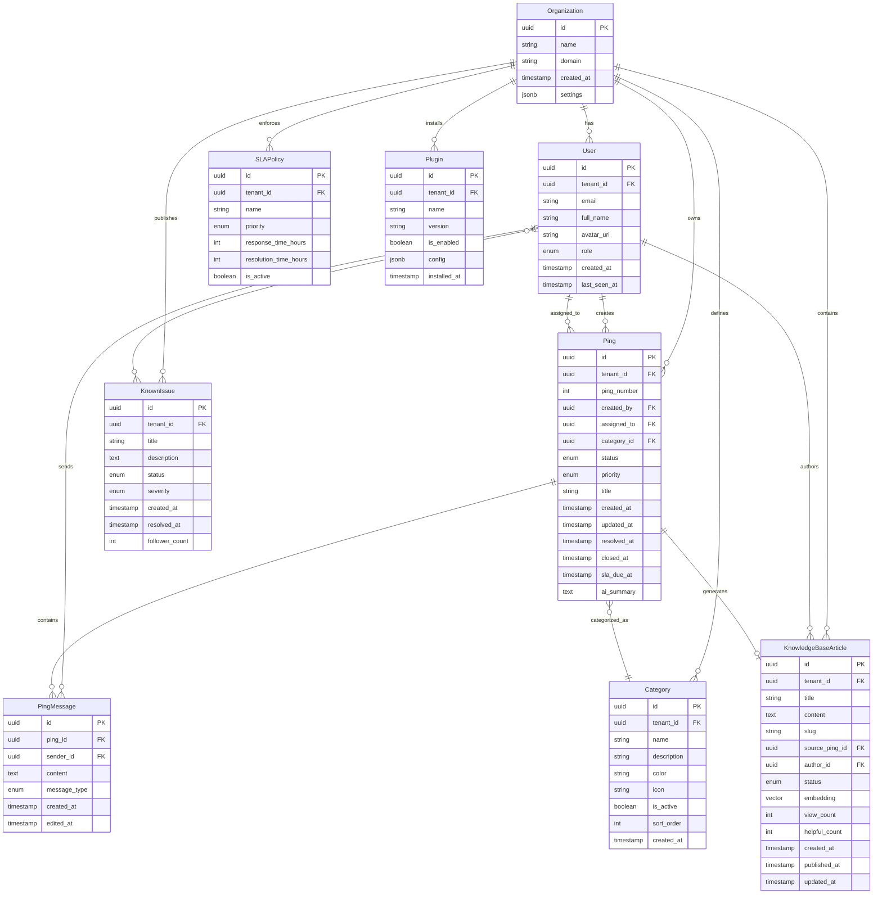

# Data Models

These are the core data models/entities shared between frontend and backend. All TypeScript interfaces are defined in `packages/types` and imported throughout the application.

## Entity Relationship Diagram



**Diagram Notes:**
- **All tables include `tenant_id`** (except Organization) for multi-tenant isolation
- **Primary keys (PK)** are all UUIDs for distributed system compatibility
- **Foreign keys (FK)** enforce referential integrity
- **RLS policies** (not shown in diagram) enforce tenant isolation at database level
- **Vector column** in KnowledgeBaseArticle uses pgvector extension for semantic search
- **JSONB columns** (settings, config) provide schema flexibility for extensibility
- **Many-to-many relationships** (User ↔ KnownIssue followers) require join table (not shown for clarity)

---

## Organization

**Purpose:** Represents a tenant (organization/company) in the multi-tenant schema. EasyPing runs in single-tenant mode (one org per deployment), while ServicePing.me supports multiple organizations.

**Key Attributes:**
- `id`: UUID - Unique identifier (primary key)
- `name`: string - Organization name (e.g., "Acme Corp IT")
- `domain`: string | null - Organization domain for email matching (e.g., "acme.com")
- `created_at`: Date - Timestamp of organization creation
- `settings`: OrganizationSettings - JSON object with configuration (branding, AI provider config, SLA policies)

### TypeScript Interface

```typescript
interface Organization {
  id: string; // UUID
  name: string;
  domain: string | null;
  created_at: Date;
  settings: OrganizationSettings;
}

interface OrganizationSettings {
  branding?: {
    logo_url?: string;
    primary_color?: string;
    company_name?: string;
  };
  ai_provider?: {
    provider: 'openai' | 'anthropic' | 'azure';
    api_key_encrypted: string;
    model: string; // e.g., "gpt-3.5-turbo", "claude-2"
    embeddings_model?: string;
  };
  features?: {
    auto_archive_days: number; // Default: 90
    max_file_size_mb: number; // Default: 10
  };
}
```

### Relationships

- One-to-many with `User` (one organization has many users)
- One-to-many with `Ping` (one organization has many pings)
- One-to-many with `Category` (one organization has many categories)
- One-to-many with `KnowledgeBaseArticle` (one organization has many KB articles)
- One-to-many with `SLAPolicy` (one organization has many SLA policies)

---

## User

**Purpose:** Represents a user account (end user, agent, manager, or owner) with role-based access control.

**Key Attributes:**
- `id`: UUID - Unique identifier (Supabase Auth user ID)
- `tenant_id`: UUID - Foreign key to `Organization`
- `email`: string - User email (unique per organization)
- `full_name`: string - Display name
- `avatar_url`: string | null - Profile picture URL (Supabase Storage)
- `role`: UserRole - One of: 'end_user', 'agent', 'manager', 'owner'
- `created_at`: Date - Account creation timestamp
- `last_seen_at`: Date | null - Last activity timestamp

### TypeScript Interface

```typescript
enum UserRole {
  END_USER = 'end_user',
  AGENT = 'agent',
  MANAGER = 'manager',
  OWNER = 'owner'
}

interface User {
  id: string; // UUID (Supabase Auth ID)
  tenant_id: string; // UUID
  email: string;
  full_name: string;
  avatar_url: string | null;
  role: UserRole;
  created_at: Date;
  last_seen_at: Date | null;
}
```

### Relationships

- Many-to-one with `Organization` (many users belong to one organization)
- One-to-many with `Ping` as creator (user creates many pings)
- One-to-many with `Ping` as assignee (agent assigned to many pings)
- One-to-many with `PingMessage` (user sends many messages)

---

## Ping

**Purpose:** Represents a support request (ping) with conversational threading, status tracking, and metadata. A ping is the core entity users create when they need help.

**Key Attributes:**
- `id`: UUID - Unique identifier
- `tenant_id`: UUID - Foreign key to `Organization`
- `ping_number`: number - Auto-incrementing display ID (e.g., #PING-001)
- `created_by`: UUID - Foreign key to `User` (ping creator)
- `assigned_to`: UUID | null - Foreign key to `User` (assigned agent)
- `category_id`: UUID | null - Foreign key to `Category`
- `status`: PingStatus - Current ping state
- `priority`: PingPriority - Urgency level
- `title`: string - Extracted from first message (AI-generated or user-provided)
- `created_at`: Date - Ping creation timestamp
- `updated_at`: Date - Last update timestamp
- `resolved_at`: Date | null - Resolution timestamp
- `closed_at`: Date | null - Closure timestamp
- `sla_due_at`: Date | null - SLA deadline
- `ai_summary`: string | null - AI-generated ping summary

### TypeScript Interface

```typescript
enum PingStatus {
  NEW = 'new',
  IN_PROGRESS = 'in_progress',
  WAITING_ON_USER = 'waiting_on_user',
  RESOLVED = 'resolved',
  CLOSED = 'closed'
}

enum PingPriority {
  LOW = 'low',
  NORMAL = 'normal',
  HIGH = 'high',
  URGENT = 'urgent'
}

interface Ping {
  id: string; // UUID
  tenant_id: string; // UUID
  ping_number: number;
  created_by: string; // UUID (User ID)
  assigned_to: string | null; // UUID (User ID)
  category_id: string | null; // UUID (Category ID)
  status: PingStatus;
  priority: PingPriority;
  title: string;
  created_at: Date;
  updated_at: Date;
  resolved_at: Date | null;
  closed_at: Date | null;
  sla_due_at: Date | null;
  ai_summary: string | null;
}
```

### Relationships

- Many-to-one with `Organization` (many pings belong to one organization)
- Many-to-one with `User` as creator
- Many-to-one with `User` as assignee (optional)
- Many-to-one with `Category` (optional)
- One-to-many with `PingMessage` (one ping has many messages)
- One-to-many with `PingAttachment` (one ping has many attachments)

---

## PingMessage

**Purpose:** Represents a single message in a ping conversation thread (from user or agent).

**Key Attributes:**
- `id`: UUID - Unique identifier
- `ping_id`: UUID - Foreign key to `Ping`
- `sender_id`: UUID - Foreign key to `User`
- `content`: string - Message text content
- `message_type`: MessageType - 'user', 'agent', or 'system'
- `created_at`: Date - Message timestamp
- `edited_at`: Date | null - Last edit timestamp

### TypeScript Interface

```typescript
enum MessageType {
  USER = 'user',
  AGENT = 'agent',
  SYSTEM = 'system' // e.g., "Agent changed status to Resolved"
}

interface PingMessage {
  id: string; // UUID
  ping_id: string; // UUID
  sender_id: string; // UUID (User ID)
  content: string;
  message_type: MessageType;
  created_at: Date;
  edited_at: Date | null;
}
```

### Relationships

- Many-to-one with `Ping` (many messages belong to one ping)
- Many-to-one with `User` as sender
- One-to-many with `MessageAttachment` (one message can have multiple attachments)

---

## Category

**Purpose:** Ping categories for routing and organization (e.g., Hardware, Software, Access Request, Network).

**Key Attributes:**
- `id`: UUID - Unique identifier
- `tenant_id`: UUID - Foreign key to `Organization`
- `name`: string - Category name (e.g., "Hardware")
- `description`: string | null - Category description
- `color`: string - Badge color (hex code)
- `icon`: string | null - Icon identifier (Lucide icon name)
- `is_active`: boolean - Whether category is active (can be archived)
- `sort_order`: number - Display order
- `created_at`: Date - Creation timestamp

### TypeScript Interface

```typescript
interface Category {
  id: string; // UUID
  tenant_id: string; // UUID
  name: string;
  description: string | null;
  color: string; // Hex color code (e.g., "#3b82f6")
  icon: string | null; // Lucide icon name (e.g., "Wrench")
  is_active: boolean;
  sort_order: number;
  created_at: Date;
}
```

### Relationships

- Many-to-one with `Organization` (many categories belong to one organization)
- One-to-many with `Ping` (one category applies to many pings)
- One-to-many with `RoutingRule` (one category has many routing rules)

---

## KnowledgeBaseArticle

**Purpose:** Represents a knowledge base article for self-service support, generated from resolved pings or manually created.

**Key Attributes:**
- `id`: UUID - Unique identifier
- `tenant_id`: UUID - Foreign key to `Organization`
- `title`: string - Article title
- `content`: string - Markdown content
- `slug`: string - URL-friendly slug
- `source_ping_id`: UUID | null - Foreign key to original `Ping` (if auto-generated)
- `author_id`: UUID - Foreign key to `User` (agent who published)
- `status`: ArticleStatus - 'draft', 'published', 'archived'
- `embedding`: number[] | null - Vector embedding for semantic search (pgvector)
- `view_count`: number - Number of times viewed
- `helpful_count`: number - Upvote count
- `created_at`: Date - Creation timestamp
- `published_at`: Date | null - Publication timestamp
- `updated_at`: Date - Last update timestamp

### TypeScript Interface

```typescript
enum ArticleStatus {
  DRAFT = 'draft',
  PUBLISHED = 'published',
  ARCHIVED = 'archived'
}

interface KnowledgeBaseArticle {
  id: string; // UUID
  tenant_id: string; // UUID
  title: string;
  content: string; // Markdown
  slug: string;
  source_ping_id: string | null; // UUID
  author_id: string; // UUID (User ID)
  status: ArticleStatus;
  embedding: number[] | null; // pgvector embedding
  view_count: number;
  helpful_count: number;
  created_at: Date;
  published_at: Date | null;
  updated_at: Date;
}
```

### Relationships

- Many-to-one with `Organization` (many articles belong to one organization)
- Many-to-one with `User` as author
- Many-to-one with `Ping` as source (optional)

---

## SLAPolicy

**Purpose:** Defines service level agreement policies with response and resolution time targets.

**Key Attributes:**
- `id`: UUID - Unique identifier
- `tenant_id`: UUID - Foreign key to `Organization`
- `name`: string - Policy name (e.g., "Standard Support")
- `priority`: PingPriority - Applies to pings with this priority
- `response_time_hours`: number - Target time for first response (in hours)
- `resolution_time_hours`: number - Target time for resolution (in hours)
- `is_active`: boolean - Whether policy is currently active

### TypeScript Interface

```typescript
interface SLAPolicy {
  id: string; // UUID
  tenant_id: string; // UUID
  name: string;
  priority: PingPriority;
  response_time_hours: number;
  resolution_time_hours: number;
  is_active: boolean;
}
```

### Relationships

- Many-to-one with `Organization` (many SLA policies belong to one organization)

---

## Plugin

**Purpose:** Represents an installed plugin with configuration and metadata.

**Key Attributes:**
- `id`: UUID - Unique identifier
- `tenant_id`: UUID - Foreign key to `Organization`
- `name`: string - Plugin name (e.g., "system-uptime-monitor")
- `version`: string - Installed version (semver)
- `is_enabled`: boolean - Whether plugin is active
- `config`: PluginConfig - JSON configuration object
- `installed_at`: Date - Installation timestamp

### TypeScript Interface

```typescript
interface Plugin {
  id: string; // UUID
  tenant_id: string; // UUID
  name: string;
  version: string;
  is_enabled: boolean;
  config: PluginConfig; // JSON object, plugin-specific
  installed_at: Date;
}

interface PluginConfig {
  [key: string]: any; // Plugin-specific configuration
}
```

### Relationships

- Many-to-one with `Organization` (many plugins belong to one organization)

---

## KnownIssue

**Purpose:** Represents a publicly visible known issue (outage, incident) that users can follow instead of creating duplicate pings.

**Key Attributes:**
- `id`: UUID - Unique identifier
- `tenant_id`: UUID - Foreign key to `Organization`
- `title`: string - Issue title (e.g., "Email Server Outage")
- `description`: string - Issue description (Markdown)
- `status`: IssueStatus - 'investigating', 'identified', 'monitoring', 'resolved'
- `severity`: IssueSeverity - 'low', 'medium', 'high', 'critical'
- `created_at`: Date - Creation timestamp
- `resolved_at`: Date | null - Resolution timestamp
- `follower_count`: number - Number of users following

### TypeScript Interface

```typescript
enum IssueStatus {
  INVESTIGATING = 'investigating',
  IDENTIFIED = 'identified',
  MONITORING = 'monitoring',
  RESOLVED = 'resolved'
}

enum IssueSeverity {
  LOW = 'low',
  MEDIUM = 'medium',
  HIGH = 'high',
  CRITICAL = 'critical'
}

interface KnownIssue {
  id: string; // UUID
  tenant_id: string; // UUID
  title: string;
  description: string; // Markdown
  status: IssueStatus;
  severity: IssueSeverity;
  created_at: Date;
  resolved_at: Date | null;
  follower_count: number;
}
```

### Relationships

- Many-to-one with `Organization` (many known issues belong to one organization)
- Many-to-many with `User` (followers tracking issue updates)

---
