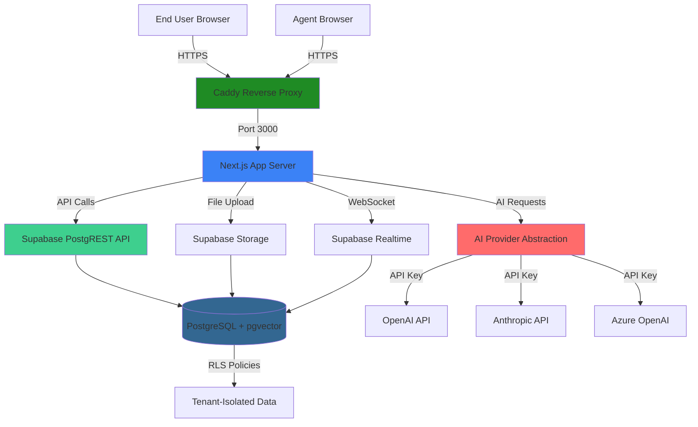

# High Level Architecture

## Technical Summary

EasyPing is built as a **serverless monolith** using Next.js 14+ (App Router) with Supabase Backend-as-a-Service (BaaS) for database, authentication, storage, and realtime functionality. The architecture follows a **monorepo pattern** organized with Turborepo and pnpm workspaces, enabling code sharing between frontend components, shared types, AI providers, and database migrations.

The system deploys as a **single Docker Compose stack** for self-hosted installations (EasyPing community edition), bundling the Next.js application with self-hosted Supabase services. The database schema is **multi-tenant ready** with `tenant_id` columns and Row Level Security (RLS) policies, but runs in **single-tenant mode** for community deployments. This design enables seamless migration to the future **ServicePing.me SaaS platform** without database refactoring.

AI capabilities are abstracted through a **provider-agnostic interface** supporting OpenAI, Anthropic, and Azure OpenAI, with users bringing their own API keys (BYOK model). The frontend uses **shadcn/ui** components with Tailwind CSS for a modern, accessible chat-first interface. Realtime updates leverage **Supabase Realtime** (WebSocket subscriptions) for live ping conversation threading. The plugin framework enables extensibility through UI extension points, webhook-based actions, and background jobs.

This architecture balances **speed to market** (leveraging Supabase BaaS), **self-hostability** (Docker Compose), **future SaaS scalability** (multi-tenant schema), and **open-core business model** (clear separation between community and proprietary features).

## Platform and Infrastructure Choice

**Selected Platform:** Self-Hosted Docker Compose (MVP) with Cloud-Ready Architecture

**Key Services:**
- **Compute:** Docker containers (Next.js app + Supabase stack)
- **Database:** PostgreSQL 15+ with pgvector extension (via Supabase)
- **Authentication:** Supabase Auth (email/password + OAuth providers)
- **Storage:** Supabase Storage (S3-compatible object storage)
- **Realtime:** Supabase Realtime (WebSocket subscriptions)
- **Reverse Proxy:** Caddy (automatic HTTPS, simple configuration)
- **Container Registry:** Docker Hub (public images)

**Deployment Host and Regions:**
- **MVP/Community Edition:** Self-hosted on user infrastructure (Ubuntu 22.04+ recommended)
- **Future ServicePing.me:** Cloud deployment (Vercel for Next.js frontend, Supabase Cloud for backend, multi-region support)

**Rationale:**

Docker Compose provides the simplest self-hosted deployment experience while maintaining architectural patterns that scale to cloud SaaS. Supabase BaaS eliminates the need to build custom auth, storage, and realtime infrastructure, accelerating development by 2-3 months. The stack supports both self-hosted (community) and cloud (SaaS) deployment modes without code changes.

**Alternative Considered:**
- **AWS Full Stack (ECS + RDS + Cognito):** More complex, higher operational overhead, slower development
- **Kubernetes:** Over-engineered for MVP self-hosted deployments, adds complexity
- **Serverless (Vercel + Planetscale):** Less self-hostable, higher vendor lock-in

## Repository Structure

**Structure:** Monorepo with pnpm workspaces + Turborepo

**Package Organization:**
```
easyping/
├── apps/
│   └── web/              # Next.js 14+ frontend application
├── packages/
│   ├── database/         # Supabase migrations, schemas, RLS policies
│   ├── ai/               # AI provider abstraction layer
│   ├── ui/               # Shared UI components (shadcn/ui wrappers)
│   └── types/            # Shared TypeScript types and interfaces
├── docker/
│   └── docker-compose.yml  # Self-hosted deployment stack
└── scripts/              # Build, migration, and deployment scripts
```

**Monorepo Tool:** Turborepo with pnpm workspaces

**Rationale:**
- **Code sharing:** Types, utilities, and UI components shared between frontend and future services
- **Atomic versioning:** All packages versioned together, simplifying releases
- **Developer experience:** Single clone, single install, unified build process
- **Turborepo caching:** Speeds up builds by caching unchanged packages
- **Community friendly:** Contributors work in one repository with clear structure

## High Level Architecture Diagram



**Component Descriptions:**
- **Caddy:** Handles HTTPS termination, routing to Next.js app
- **Next.js App:** Server-side rendering, API routes, client-side React
- **Supabase PostgREST:** Auto-generated REST API from database schema
- **PostgreSQL:** Multi-tenant database with RLS policies, pgvector for embeddings
- **Supabase Realtime:** WebSocket server for live ping updates
- **Supabase Storage:** S3-compatible object storage for file attachments
- **AI Provider Abstraction:** Unified interface for multiple AI providers (OpenAI, Anthropic, Azure)

## Architectural Patterns

- **Jamstack Architecture:** Static site generation with serverless APIs - _Rationale:_ Next.js App Router enables hybrid SSR/SSG for optimal performance and SEO
- **Backend-as-a-Service (BaaS):** Leverage Supabase for auth, database, storage, realtime - _Rationale:_ Eliminates months of backend development, focuses effort on core features
- **Multi-Tenant Single-Instance:** Database schema supports multi-tenancy but deploys as single tenant - _Rationale:_ Enables future SaaS migration without database refactoring
- **Repository Pattern:** Abstract data access through typed interfaces - _Rationale:_ Enables testing with mocked data, potential future database migration
- **Provider Pattern:** AI abstraction layer with swappable implementations - _Rationale:_ Supports multiple AI providers, graceful degradation when unavailable
- **Plugin Architecture:** Event-driven webhooks with UI extension points - _Rationale:_ Community can extend functionality without forking core code
- **API Gateway Pattern:** Next.js API routes as single entry point - _Rationale:_ Centralized auth, rate limiting, and error handling
- **Component-Based UI:** Reusable React components with TypeScript - _Rationale:_ Maintainability and type safety across large codebase
- **Optimistic UI Updates:** Update UI immediately, sync with server - _Rationale:_ Chat-first UX requires instant feedback for messages
- **Realtime Subscriptions:** WebSocket-based live updates via Supabase - _Rationale:_ Ping conversations feel like live chat (Slack-style experience)

---
