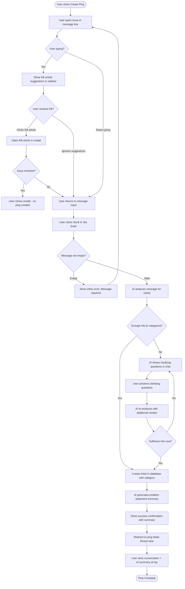
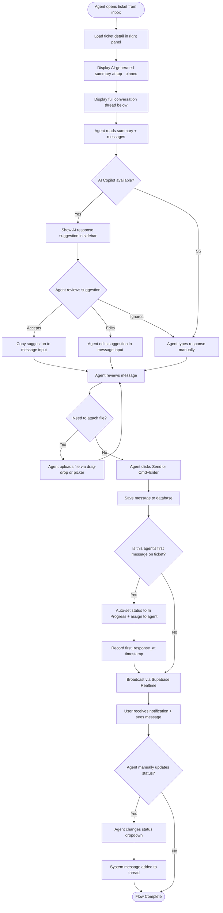
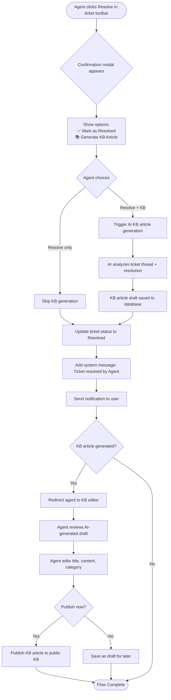
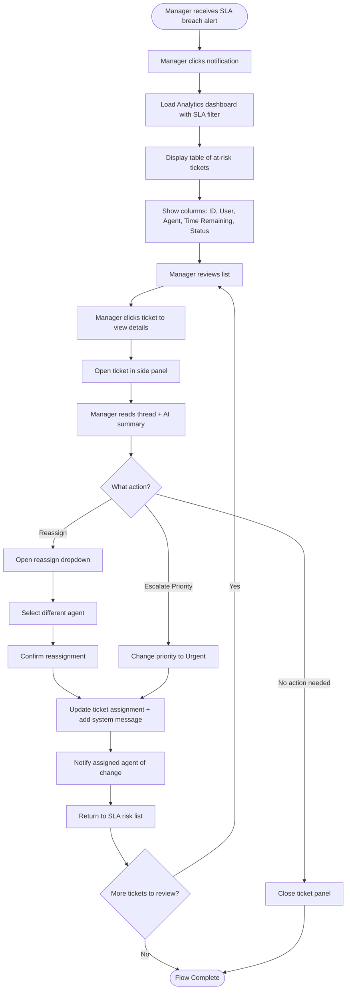

# EasyPing UI/UX Specification

This document defines the user experience goals, information architecture, user flows, and visual design specifications for EasyPing's user interface. It serves as the foundation for visual design and frontend development, ensuring a cohesive and user-centered experience.

## Overall UX Goals & Principles

### Target User Personas

**End User (Primary):** Non-technical employees who need help from IT/support teams. They're frustrated with traditional ticketing systems that feel like filling out tax forms. They want to describe their problem naturally and get help quickly without learning specialized vocabulary or navigating complex interfaces.

**Agent (Primary):** Support team members who respond to 20-50 tickets daily. They need efficiency, context, and tools that help them resolve issues faster. They value keyboard shortcuts, AI assistance, and a clean interface that doesn't overwhelm them with information.

**Manager (Secondary):** Team leads who need visibility into team performance, SLA compliance, and ticket trends. They want actionable insights without spending hours in analytics tools.

**System Owner (Tertiary):** Self-hosting administrators who configure EasyPing for their organization. They need a simple setup experience and clear configuration options.

### Usability Goals

1. **Ease of learning:** First-time users can create their first ping and receive a response within 2 minutes without any training
2. **Efficiency of use:** Agents can triage and respond to tickets 50% faster than traditional ticketing systems through AI assistance and keyboard shortcuts
3. **Error prevention:** Destructive actions (delete ticket, close without response) require confirmation; AI categorization reduces misfiled tickets
4. **Memorability:** Users returning after 2 weeks can navigate without relearning the interface
5. **Satisfaction:** The interface feels modern, responsive, and delightful—users prefer it to email for support requests

### Design Principles

1. **Conversational over Forms** - Users describe problems naturally in chat, not through dropdown menus and text fields. The system extracts structure from conversation, not the other way around.

2. **Progressive Disclosure** - Start simple, reveal complexity on demand. New users see a message box; power users discover keyboard shortcuts, filters, and advanced features organically.

3. **AI-Augmented, Never AI-Gated** - AI suggests, never blocks. If categorization fails, the ticket still gets created. If response suggestions timeout, agents can still reply manually.

4. **Realtime by Default** - Updates appear instantly without refreshing. Typing indicators, message delivery, status changes—everything feels live like Slack or iMessage.

5. **Keyboard-First for Agents** - Full keyboard navigation (Tab, Enter, Cmd+K) for agents who live in the tool. Mouse is optional, never required.

### Change Log

| Date | Version | Description | Author |
|------|---------|-------------|--------|
| 2025-01-22 | 0.1 | Initial UX goals and principles | Sally (UX Expert) |

## Information Architecture (IA)

### Site Map / Screen Inventory

```mermaid
graph TD
    Root[EasyPing] --> Auth[Authentication]
    Root --> EndUser[End User Views]
    Root --> Agent[Agent Views]
    Root --> Manager[Manager Views]
    Root --> Admin[Admin Views]

    Auth --> Login[Login]
    Auth --> Signup[Sign Up]
    Auth --> Reset[Password Reset]
    Auth --> Setup[First-Run Setup Wizard]

    EndUser --> CreatePing[Create Ping]
    EndUser --> MyPings[My Pings - Conversation List]
    EndUser --> PingDetail[Ping Detail / Thread View]
    EndUser --> KnownIssues[Known Issues Board]
    EndUser --> KBSearch[Knowledge Base Search]
    EndUser --> KBArticle[KB Article Detail]
    EndUser --> UserSettings[User Settings]

    Agent --> AgentInbox[Agent Inbox / Queue]
    Agent --> AgentTicketDetail[Ticket Detail with AI Copilot]
    Agent --> AgentKBEditor[KB Article Editor]
    Agent --> AgentDashboard[Agent Dashboard - Personal Metrics]
    Agent --> AgentSettings[Agent Settings]

    Manager --> AnalyticsDashboard[Analytics Dashboard]
    Manager --> TeamOverview[Team Overview]
    Manager --> SLAConfig[SLA Configuration]
    Manager --> CategoryMgmt[Category Management]

    Admin --> SystemSettings[System Settings]
    Admin --> UserMgmt[User Management]
    Admin --> BrandingConfig[Branding Configuration]
    Admin --> AIProviderConfig[AI Provider Setup]
    Admin --> PluginMgmt[Plugin Management]
```



### Navigation Structure

**Primary Navigation (Sidebar - Left Side):**

The primary navigation adapts based on user role:

**End User Navigation:**
- 🏠 Home (My Pings conversation list)
- ➕ Create Ping
- 🔔 Known Issues (public board)
- 📚 Knowledge Base
- ⚙️ Settings

**Agent Navigation:**
- 📥 Inbox (assigned tickets + unassigned queue)
- 📊 My Dashboard
- 🎫 All Tickets (searchable, filterable list)
- 🔔 Known Issues (with admin controls)
- 📚 Knowledge Base (with editor access)
- ⚙️ Settings

**Manager Navigation:**
- 📊 Analytics
- 👥 Team Overview
- 📥 All Tickets
- ⏱️ SLA Configuration
- 🏷️ Categories
- 📚 Knowledge Base
- ⚙️ Settings

**Admin/Owner Navigation:**
- 📊 Analytics
- 🎫 All Tickets
- 👥 User Management
- 🔌 Plugins
- 🎨 Branding
- 🤖 AI Configuration
- ⚙️ System Settings

**Secondary Navigation:**

- **Top Bar:** User profile menu (dropdown), notifications bell, organization name/logo
- **Contextual Toolbars:** Ticket detail view has toolbar with status dropdown, assignment, priority, SLA timer
- **Tabs:** Analytics dashboard uses tabs for different views (Overview, Trends, Agents)

**Breadcrumb Strategy:**

Breadcrumbs are used sparingly, only for deep hierarchical navigation:
- **Knowledge Base:** Home > Knowledge Base > Category Name > Article Title
- **Settings:** Home > Settings > Section Name
- **Not used for tickets:** Tickets use back navigation or Cmd+K to jump between views

## User Flows

### Flow 1: End User Creates First Ping

**User Goal:** Report an issue and receive help from support team

**Entry Points:**
- "Create Ping" button in sidebar
- Empty state in "My Pings" with prominent CTA
- Direct URL: `/pings/new`

**Success Criteria:**
- Ticket created successfully
- User sees confirmation and their message in thread
- Agent receives ticket in inbox

#### Flow Diagram



#### Edge Cases & Error Handling:
- **Empty message:** Show inline validation error "Please describe your issue"
- **Network failure during AI analysis:** Show retry button with error message, don't create ticket yet
- **AI analysis timeout (>5s):** Create ticket anyway with category "Needs Review" and flag for agent attention
- **User abandons clarification:** After 2 unanswered clarifying questions, create ticket with partial info and "Needs Clarification" flag
- **KB suggestions timeout:** Hide suggestions, don't block ticket creation flow
- **File attachment during creation:** Upload file first, include in AI analysis context
- **AI asks irrelevant questions:** Provide "Skip and create ticket anyway" option after first clarifying question

**Notes:**

**Conversational Intake Process:**
The ticket creation is now a guided conversation. When the user's initial message lacks detail (e.g., "My computer is broken"), the AI asks targeted clarifying questions:
- "What symptoms are you experiencing?"
- "When did this issue start?"
- "Have you tried restarting your device?"

This ensures tickets have sufficient context before creation, reducing back-and-forth and improving agent efficiency.

**AI Clarification Examples:**
- **Vague:** "Email not working" → AI asks: "Are you unable to send emails, receive them, or both? What error message do you see?"
- **Ambiguous:** "The system is slow" → AI asks: "Which system are you referring to? When does the slowness occur?"
- **Incomplete:** "Can't log in" → AI asks: "Which application are you trying to access? What happens when you try to log in?"

**Escape Hatches:**
- Users can click "Skip questions and create ticket" at any time (creates ticket with "Needs Clarification" category)
- After 3 clarifying question rounds, AI automatically creates ticket to prevent frustration
- KB suggestions remain visible throughout clarification process

**Performance:**
- AI analysis happens in <2 seconds for 95% of cases
- Clarifying questions are single-choice or short text (not essays)
- Previous context is maintained throughout conversation (no repeat questions)

---

### Flow 2: Agent Responds to Ticket with AI Assistance

**User Goal:** Review incoming ticket, understand context, and send helpful response quickly

**Entry Points:**
- Agent clicks ticket from inbox list
- Notification → direct link to ticket
- Cmd+K command palette → search ticket ID

**Success Criteria:**
- Agent understands ticket context quickly (via AI summary)
- Response sent successfully
- User receives realtime notification

#### Flow Diagram



#### Edge Cases & Error Handling:
- **AI summary fails to generate:** Show message "Summary unavailable" but display full thread
- **AI copilot timeout:** Hide suggestion panel, don't block agent from typing
- **Message send fails:** Show error banner with retry button, preserve message in input
- **File upload fails:** Show inline error under file, allow message send without attachment
- **Realtime connection dropped:** Show warning banner "Updates may be delayed"
- **Agent loses internet mid-typing:** Auto-save draft to localStorage, restore on reconnect

**Notes:**

**Auto-Status Behavior:**
- Agent's first message on a New ticket automatically changes status to "In Progress" and assigns ticket to that agent
- Records `first_response_at` timestamp (stops "First Response Time" SLA timer)
- When user responds and status is "Waiting on User", automatically changes back to "In Progress" (resumes SLA timer)
- Agent can manually set status to "Waiting on User" when asking user to test/provide info (pauses SLA timer)

**AI Copilot:**
- AI Copilot runs asynchronously—suggestions appear within 2-3 seconds but never block the agent
- Typing indicators show to the user when agent is composing
- Cmd+Enter keyboard shortcut sends message

---

### Flow 3: Agent Resolves Ticket and Creates KB Article

**User Goal:** Close ticket as resolved and optionally generate KB article for future self-service

**Entry Points:**
- Agent clicks "Resolve" status in ticket toolbar
- Keyboard shortcut: `Cmd+Shift+R`

**Success Criteria:**
- Ticket marked as resolved
- User notified of resolution
- KB article draft generated (if opted in)
- Agent can review and publish KB article

#### Flow Diagram



#### Edge Cases & Error Handling:
- **AI KB generation fails:** Show error message "KB article generation failed, you can create one manually"
- **User declines KB generation:** Only resolve ticket, skip KB workflow
- **Agent closes KB editor without publishing:** Auto-save draft, show toast "Draft saved"
- **Network failure during publish:** Show retry button, keep draft safe in database
- **Ticket has insufficient content for KB:** AI returns error, agent notified

**Notes:** KB article generation is opt-in per resolution to avoid noise. Articles are drafted immediately but require agent review before publishing. This ensures quality while reducing agent effort.

---

### Flow 4: Manager Reviews SLA Breach Alert

**User Goal:** Identify tickets at risk of SLA breach and take corrective action

**Entry Points:**
- In-app notification: "3 tickets approaching SLA breach"
- Analytics dashboard: SLA compliance widget shows red indicator
- Email digest: Daily summary of SLA risks

**Success Criteria:**
- Manager identifies at-risk tickets
- Manager reassigns or escalates tickets
- SLA compliance improves

#### Flow Diagram



#### Edge Cases & Error Handling:
- **No available agents for reassignment:** Show warning "All agents at capacity" with option to escalate
- **SLA policy not configured:** Show setup prompt with link to SLA configuration
- **Ticket resolved while manager reviewing:** Remove from list with success message
- **Manager lacks permission to reassign:** Show error "Contact owner to enable reassignment"
- **Multiple managers reviewing same ticket:** Show presence indicator "Jane is viewing this ticket"

**Notes:** SLA timer is prominent in ticket toolbar for agents and managers. Breached tickets turn red. Notifications are configurable (instant, hourly digest, daily digest). Managers can bulk reassign from table view.

## Wireframes & Mockups

**Primary Design Files:** High-fidelity mockups will be created in Figma (link to be added once created)

**Design Tool Recommendations:**
- **Figma** for collaborative design and prototyping
- **v0 by Vercel** or **Lovable** for AI-generated component prototypes using shadcn/ui
- **Excalidraw** for quick low-fidelity wireframes and flow diagrams

### Key Screen Layouts

#### Screen 1: My Pings (End User Conversation List)

**Purpose:** Primary home screen for end users showing all their active support conversations

**Key Elements:**
- **Header:** "My Pings" title, Create Ping button (prominent, top-right)
- **Filter Tabs:** All (default), Active, Resolved, Archived
- **Conversation List:** Similar to iMessage/Slack conversation list:
  - Each item shows:
    - Agent avatar (left side)
    - Ping ID + Status badge (e.g., "#PING-042" with 🟡 In Progress)
    - Last message preview (truncated to 2 lines)
    - Timestamp (relative: "2m ago", "Yesterday", "Jan 15")
    - **NO SLA timers** (end users don't see countdown clocks)
    - Unread count badge (if unread messages)
  - Hover state reveals quick actions (archive, mark resolved)
  - Click opens ping detail view
- **Empty State:** "No pings yet. Need help? Send your first ping!" with Create Ping CTA
- **Sidebar Navigation:** Persistent left sidebar (see IA section)

**Interaction Notes:**
- List items are clickable rows with subtle hover effect (background lightens)
- Unread pings appear with bold text and colored left border accent
- Realtime updates: New messages appear at top, timestamps update live
- Infinite scroll or "Load More" for pings beyond 50
- Keyboard navigation: Arrow keys move selection, Enter opens ping
- **Static expectations shown instead of timers:** "Typically resolved within 8 hours" (on ticket creation confirmation)

**Design File Reference:** [Figma frame to be linked]

---

#### Screen 2: Create Ping (Chat-First Ticket Creation)

**Purpose:** Allow users to describe their issue naturally without forms

**Key Elements:**
- **Header:** "Send a Ping" title, close button (X) to return to My Pings
- **Message Input Area (Primary):**
  - Large textarea with placeholder: "Describe your issue... what can we help with?"
  - Character count indicator (optional, if there's a limit)
  - Attachment button (paperclip icon) below textarea
  - Send button (primary blue, right-aligned) and Cancel link (left-aligned)
- **KB Suggestions Sidebar (Right, 30% width):**
  - Title: "Related articles"
  - List of 3-5 KB article suggestions (updated as user types, debounced 300ms)
  - Each suggestion shows: article title, snippet (1-2 lines), "Read more" link
  - If no suggestions: "No related articles found"
- **Attachment Preview:** Shows selected files with filename, size, remove button

**Interaction Notes:**
- Auto-focus on textarea on page load
- Enter sends message (Shift+Enter for new line)
- KB suggestions use semantic search, update dynamically as user types
- Clicking KB article opens in modal (overlay) without losing draft
- Draft auto-saved to localStorage every 5 seconds
- File upload: Drag-drop onto textarea or click paperclip to browse
- Validation: Show inline error if message is empty on submit

**Design File Reference:** [Figma frame to be linked]

---

#### Screen 3: Agent Inbox (Split View with AI Copilot)

**Purpose:** Unified queue for agents to triage and respond to tickets efficiently

**Key Elements:**
- **Left Panel (Ticket List, 35% width):**
  - Header: "Inbox" title, filter dropdown (All, Assigned to Me, Unassigned, Urgent), sort by "SLA Risk"
  - Ticket cards in list:
    - Ping ID, user name, user avatar
    - Subject line (first message truncated)
    - Status badge, priority indicator
    - **SLA Timer Badge (most urgent):** Color-coded badge showing either First Response or Resolution timer
      - If First Response not met: "🟡 1h 23m" (First Response timer)
      - If First Response met: "🟢 6h 15m" (Resolution timer)
      - If breached: "🔴 23m" (shows breached timer in red)
    - Category tag
    - Last activity timestamp
  - Hover state shows:
    - Quick actions (assign, change priority)
    - **Tooltip with both SLA timers:** "✅ First response: 23m (within 2h SLA) | 🟡 Resolution: 1d 14h remaining"
  - Selected ticket highlighted with left accent border
- **Right Panel (Ticket Detail, 45% width):**
  - **Toolbar (Top):**
    - Status dropdown, assignment dropdown, priority dropdown
    - **Dual SLA Timer Display:**
      - Before first response: "🟡 First response due in 1h 23m" + "🟢 Resolution due in 2d 18h"
      - After first response: "✅ First response: 45m (within SLA)" + "🟡 Resolution due in 2d 6h"
      - When Waiting on User: "✅ First response: 45m" + "⏸️ Resolution timer paused (waiting on user)"
      - When breached: "🔴 First response BREACHED (2h 15m ago)"
  - **Pinned AI Summary:** Collapsed by default, expandable
  - **Conversation Thread:** Chronological message list, alternating left/right for user/agent
  - **Message Input:** Bottom-fixed textarea with Send button
- **AI Copilot Panel (Far Right, 20% width, collapsible):**
  - Title: "AI Suggestions"
  - Response suggestion with "Use this response" button
  - Suggested KB articles to share
  - Suggested category/priority changes
  - Collapse button to hide panel and expand ticket detail

**Interaction Notes:**
- Keyboard shortcuts: `j/k` to navigate ticket list, `c` to compose reply, `Cmd+Enter` to send
- Realtime: New tickets appear at top with subtle slide-in animation
- **SLA timer auto-updates:** Refreshes every 60 seconds, color transitions (green → yellow → red)
- **SLA breach toast:** Notification appears when ticket enters red zone or breaches
- Agent can drag-drop files into message input
- Typing indicator shows to user when agent is composing
- AI Copilot panel can be toggled with `Cmd+Shift+A`
- **Sort by SLA Risk:** Breached tickets first, then at-risk (yellow), then on-track (green)

**Design File Reference:** [Figma frame to be linked]

---

#### Screen 4: Knowledge Base Search (Self-Service)

**Purpose:** Allow users to find answers without creating tickets

**Key Elements:**
- **Header:** "Knowledge Base" title, breadcrumb (if in category)
- **Search Bar (Prominent, Top Center):**
  - Large search input with placeholder: "Search for help..."
  - Magnifying glass icon (left side)
  - Voice search icon (optional, right side)
  - Search happens on-type (debounced 300ms) with semantic search
- **Search Results:** List of article cards:
  - Article title (clickable)
  - Snippet (2-3 lines with search term highlighted)
  - Category tag
  - Helpful count (e.g., "👍 42 people found this helpful")
  - Last updated timestamp
- **Categories Sidebar (Left, if no search query):**
  - List of KB categories with article counts
  - Clickable to filter results
- **Empty State:** "No articles found. Try different keywords or contact support."

**Interaction Notes:**
- Search results update in realtime as user types
- Clicking article opens detail page
- Breadcrumbs: Knowledge Base > Category Name > Article Title
- "Was this helpful?" feedback buttons at end of each article
- Keyboard navigation: Tab through results, Enter to open article

**Design File Reference:** [Figma frame to be linked]

---

#### Screen 5: Analytics Dashboard (Manager)

**Purpose:** Provide managers with actionable insights into team performance and ticket trends

**Key Elements:**
- **Header:** "Analytics" title, date range selector (Last 7 days, Last 30 days, Custom)
- **Key Metrics Cards (Top Row, 4 cards):**
  - Total Pings (with trend indicator: ↑ +12% vs last period)
  - Avg Resolution Time (hours)
  - SLA Compliance Rate (percentage with progress bar)
  - Agent Utilization (percentage)
- **Charts (Middle Section, 2 columns):**
  - Left: Ping Volume Over Time (line chart)
  - Right: Pings by Category (pie chart or bar chart)
- **Tables (Bottom Section):**
  - Top Categories by volume (table with 5 rows)
  - Agent Performance (table: agent name, pings resolved, avg time, SLA compliance)
- **Filters:** Category filter, agent filter, status filter (dropdowns above charts)

**Interaction Notes:**
- All charts are interactive (hover for tooltips, click to drill down)
- Date range selector updates all metrics and charts
- Export button (top-right) downloads data as CSV
- Clicking metric card navigates to filtered ticket view
- Responsive: On mobile, cards stack vertically, charts become scrollable

**Design File Reference:** [Figma frame to be linked]

## Component Library / Design System

**Design System Approach:** EasyPing uses **shadcn/ui** as the foundation, built on Radix UI primitives with Tailwind CSS styling. This provides accessible, unstyled components that can be fully customized to match EasyPing branding without runtime JS overhead. Components are copied into the codebase (not installed as npm dependency), allowing full control and customization.

**Benefits of this approach:**
- Accessible by default (ARIA labels, keyboard navigation, screen reader support)
- Fully customizable via Tailwind classes
- No lock-in to external library versions
- Tree-shakeable (only include what you use)
- TypeScript-first with excellent type safety

### Core Components

#### Component: Button

**Purpose:** Primary interaction element for actions and navigation

**Variants:**
- `default` - Primary blue background (#3B82F6)
- `secondary` - Gray background for secondary actions
- `outline` - Transparent with border
- `ghost` - Transparent, appears on hover
- `destructive` - Red background for dangerous actions (delete, close)
- `link` - Styled as hyperlink

**States:**
- `default` - Normal state
- `hover` - Slightly darker background
- `focus` - Visible focus ring for keyboard navigation
- `active` - Pressed state
- `disabled` - Grayed out, not clickable

**Usage Guidelines:**
- Use `default` for primary actions (Send, Save, Create)
- Use `outline` or `ghost` for secondary actions (Cancel, Back)
- Use `destructive` sparingly, always with confirmation modal
- Minimum touch target: 44px height on mobile
- Include loading spinner for async actions

---

#### Component: Input / Textarea

**Purpose:** Text entry fields for forms and message composition

**Variants:**
- `text` - Single-line text input
- `textarea` - Multi-line text input (resizable)
- `email` - Email validation
- `password` - Obscured text with show/hide toggle
- `search` - Search icon, clear button

**States:**
- `default` - Empty or filled
- `focus` - Border highlights in blue
- `error` - Red border with error message below
- `disabled` - Grayed out, not editable
- `readonly` - Visible but not editable

**Usage Guidelines:**
- Always pair with visible label (not just placeholder)
- Use placeholder text for examples, not instructions
- Show character count for limited fields
- Inline validation on blur, not on every keystroke
- Error messages should be specific ("Email is required" not "Invalid input")

---

#### Component: Select / Dropdown

**Purpose:** Choose from predefined options (status, assignment, category, etc.)

**Variants:**
- `single` - Select one option
- `multi` - Select multiple options with checkboxes
- `searchable` - Large lists with search/filter capability
- `creatable` - Allow user to add new options (e.g., category management)

**States:**
- `closed` - Shows selected value or placeholder
- `open` - Dropdown menu visible
- `focus` - Keyboard navigation highlights option
- `disabled` - Grayed out, not clickable

**Usage Guidelines:**
- Use for 4-20 options; radio buttons for <4, autocomplete for >20
- Show current selection prominently
- Keyboard navigation: Arrow keys, Enter to select, Esc to close
- Search triggers after 3 characters typed
- Group related options with section headings

---

#### Component: Badge / Tag

**Purpose:** Display status, category, priority, or metadata

**Variants:**
- `default` - Neutral gray
- `status` - Color-coded by ticket status (green=resolved, yellow=in progress, etc.)
- `priority` - Color-coded by urgency (red=urgent, orange=high, etc.)
- `category` - Consistent color per category for visual recognition
- `removable` - Includes X button to remove (for filters, selections)

**States:**
- `default` - Static display
- `interactive` - Clickable (e.g., filter by this category)
- `removable` - Shows X on hover

**Usage Guidelines:**
- Use sparingly to avoid visual clutter
- Color-code consistently (status colors defined in branding section)
- Keep text short (1-2 words max)
- Use icons sparingly within badges

---

#### Component: Modal / Dialog

**Purpose:** Focus user attention on important tasks or information

**Variants:**
- `alert` - Non-dismissible, requires action
- `confirm` - Confirm destructive action with Cancel/Confirm buttons
- `form` - Larger modal with multi-field form
- `slideout` - Side panel that slides in from right (for ticket detail, AI copilot)

**States:**
- `open` - Modal visible with overlay backdrop
- `closed` - Hidden

**Usage Guidelines:**
- Use sparingly; prefer inline editing over modals
- Always provide clear close affordance (X button, Cancel button, Esc key)
- Destructive actions require confirmation modal
- Focus trap: Tab cycles through modal elements only
- Backdrop click closes modal (except for alert variant)
- Overlay backdrop darkens background (rgba(0,0,0,0.5))

---

#### Component: Toast / Notification

**Purpose:** Provide feedback for actions without interrupting workflow

**Variants:**
- `success` - Green check icon, success message
- `error` - Red X icon, error message with optional retry button
- `warning` - Yellow alert icon, cautionary message
- `info` - Blue info icon, informational message
- `loading` - Spinner icon, for long-running operations

**States:**
- `visible` - Toast appears with slide-in animation
- `dismissed` - Fades out after timeout or manual dismissal

**Usage Guidelines:**
- Auto-dismiss after 3-5 seconds (except error toasts with actions)
- Stack multiple toasts vertically (max 3 visible)
- Position: Bottom-right for desktop, top-center for mobile
- Include action button for undo-able operations
- Use sparingly; don't toast every minor action

---

#### Component: Command Palette (Cmd+K)

**Purpose:** Keyboard-first navigation and search for power users

**Variants:**
- `default` - Search tickets, navigate screens, execute actions

**States:**
- `open` - Overlay modal with search input and results
- `closed` - Hidden

**Usage Guidelines:**
- Trigger: Cmd+K (Mac) or Ctrl+K (Windows/Linux)
- Search as you type with instant results
- Group results by type (Tickets, Pages, Actions, KB Articles)
- Keyboard navigation: Arrow keys, Enter to select, Esc to close
- Show keyboard shortcuts for common actions
- Recent searches appear when palette opens

---

#### Component: Avatar

**Purpose:** Visual representation of users and agents

**Variants:**
- `image` - User-uploaded profile picture
- `initials` - Generated from user name (fallback if no image)
- `icon` - Generic user icon (fallback for system messages)

**States:**
- `default` - Normal display
- `online` - Green indicator dot for active users (realtime presence)
- `offline` - No indicator

**Usage Guidelines:**
- Size variants: `xs` (24px), `sm` (32px), `md` (40px), `lg` (64px)
- Use `md` for inbox/thread lists, `lg` for profile pages
- Generate consistent background colors from user ID (hash-based color)
- Alt text: User's full name for screen readers

---

#### Component: Loading Skeleton

**Purpose:** Show content placeholders while data loads

**Variants:**
- `text` - Gray bars mimicking text lines
- `card` - Rectangle mimicking card shape
- `list` - Multiple rows for lists
- `avatar` - Circle mimicking avatar

**States:**
- `loading` - Animated shimmer effect
- `loaded` - Replaced with actual content

**Usage Guidelines:**
- Use for initial page loads and long data fetches (>500ms)
- Match skeleton shape to actual content layout
- Subtle animation (shimmer effect, not pulsing)
- Remove immediately when data arrives (no fade-out delay)

---

#### Component: SLA Timer (Agent-Only)

**Purpose:** Display SLA countdown timers to help agents prioritize tickets

**Variants:**
- `first-response` - Shows time until first response SLA breach
- `resolution` - Shows time until resolution SLA breach
- `completed` - Shows completed SLA (e.g., "First response: 23m (within SLA)")
- `breached` - Shows breached SLA (e.g., "BREACHED (2h 15m ago)")
- `paused` - Shows paused Resolution SLA when status is "Waiting on User"

**States:**
- `green` - More than 50% time remaining (low urgency)
- `yellow` - 20-50% time remaining (moderate urgency)
- `red` - Less than 20% time remaining or breached (high urgency)

**Display Formats:**
- **Compact (ticket list):** Color badge + time: "🟡 1h 23m"
- **Full (ticket detail):** Label + time + context: "🟡 First response due in 1h 23m"
- **Tooltip (hover):** Both timers: "✅ First response: 23m (within 2h SLA) | 🟡 Resolution: 1d 14h remaining"

**Usage Guidelines:**
- **Ticket list:** Show ONLY most urgent timer (First Response if not met, otherwise Resolution)
- **Ticket detail:** Show BOTH timers with full context
- **Color transitions:** Update color in real-time as time elapses (green → yellow → red)
- **Paused state:** Show "⏸️" icon when Resolution timer paused (status = Waiting on User)
- **Never show to end users:** SLA timers are agent-only feature
- **Auto-refresh:** Update every 60 seconds or use countdown animation
- **Breach notification:** Toast notification when timer crosses into red zone

**Time Formatting:**
- `< 1 hour`: Show minutes (e.g., "23m")
- `1-24 hours`: Show hours + minutes (e.g., "1h 23m")
- `> 24 hours`: Show days + hours (e.g., "2d 6h")
- `Breached`: Show "BREACHED (X over)" (e.g., "BREACHED (2h 15m ago)")

## Branding & Style Guide

**Brand Guidelines:** EasyPing is part of the **ping.me ecosystem**. All visual design should reinforce the "ping" metaphor (signals, connections, communication) while maintaining a modern SaaS aesthetic.

### Visual Identity

**Brand Positioning:**
- Modern and professional, not corporate/sterile
- Open-source friendly and welcoming
- Clean, minimalist design with purposeful details
- "Slack for support tickets" visual language

**Logo Concept:**
- Simple, memorable icon suggesting ping/wave/signal
- Potential concepts: concentric circles, radio waves, chat bubble with ripple effect
- Works in monochrome and color
- Scalable from 16px favicon to large format

### Color Palette

| Color Type | Hex Code | Usage |
|------------|----------|-------|
| **Primary** | `#3B82F6` | Primary buttons, links, brand elements, focus states |
| **Primary Hover** | `#2563EB` | Hover state for primary buttons |
| **Secondary** | `#8B5CF6` | Accent elements, secondary emphasis |
| **Success** | `#10B981` | Positive feedback, confirmations, resolved status |
| **Warning** | `#F59E0B` | Cautions, important notices, in-progress status |
| **Error** | `#EF4444` | Errors, destructive actions, SLA breaches |
| **Info** | `#3B82F6` | Informational messages (same as primary) |
| **Neutral 50** | `#F9FAFB` | Background, subtle surfaces |
| **Neutral 100** | `#F3F4F6` | Hover backgrounds, disabled states |
| **Neutral 200** | `#E5E7EB` | Borders, dividers |
| **Neutral 400** | `#9CA3AF` | Placeholder text, disabled text |
| **Neutral 600** | `#4B5563` | Secondary text, labels |
| **Neutral 900** | `#111827` | Primary text, headings |

**Status Color Mapping:**
- 🟢 Resolved: Success green (#10B981)
- 🟡 In Progress: Warning yellow (#F59E0B)
- 🔵 Waiting on User: Info blue (#3B82F6)
- 🔴 SLA Breach: Error red (#EF4444)
- ⚪ New: Neutral gray (#9CA3AF)

**SLA Timer Color Mapping (Agent-Only):**
- 🟢 Green: >50% time remaining (#10B981) - On track, low urgency
- 🟡 Yellow: 20-50% time remaining (#F59E0B) - At risk, moderate urgency
- 🔴 Red: <20% time remaining or breached (#EF4444) - Critical, high urgency
- ⏸️ Paused: Gray (#9CA3AF) - Resolution timer paused (Waiting on User status)

### Typography

#### Font Families

- **Primary:** Inter (Google Fonts) - Used for all UI text, headings, body copy
- **Secondary:** Inter (same family for consistency)
- **Monospace:** `ui-monospace, SFMono-Regular, 'SF Mono', Menlo, Consolas, 'Liberation Mono', monospace` - Used for code snippets, ticket IDs, technical data

#### Type Scale

| Element | Size | Weight | Line Height | Usage |
|---------|------|--------|-------------|-------|
| **H1** | 36px (2.25rem) | 700 (Bold) | 40px (1.1) | Page titles, main headings |
| **H2** | 30px (1.875rem) | 600 (Semibold) | 36px (1.2) | Section headings |
| **H3** | 24px (1.5rem) | 600 (Semibold) | 32px (1.33) | Subsection headings |
| **H4** | 20px (1.25rem) | 600 (Semibold) | 28px (1.4) | Card titles, component headings |
| **Body** | 16px (1rem) | 400 (Regular) | 24px (1.5) | Default paragraph text, UI labels |
| **Body Small** | 14px (0.875rem) | 400 (Regular) | 20px (1.43) | Secondary text, timestamps |
| **Caption** | 12px (0.75rem) | 400 (Regular) | 16px (1.33) | Metadata, helper text |
| **Button** | 14px (0.875rem) | 500 (Medium) | 20px (1.43) | Button text |

**Tailwind CSS Mapping:**
- H1: `text-4xl font-bold`
- H2: `text-3xl font-semibold`
- H3: `text-2xl font-semibold`
- H4: `text-xl font-semibold`
- Body: `text-base font-normal`
- Small: `text-sm font-normal`
- Caption: `text-xs font-normal`

### Iconography

**Icon Library:** Lucide React (lucide-react npm package)

**Icon Guidelines:**
- Use 24px icons for primary actions and navigation
- Use 20px icons for inline text and small buttons
- Use 16px icons for compact displays and metadata
- Stroke width: 2px (default Lucide)
- Always include ARIA labels for icon-only buttons
- Pair icons with text labels for clarity (icon alone only for common actions like close, search)

**Common Icon Mappings:**
- Create Ping: `MessageSquarePlus` or `Send`
- Inbox: `Inbox`
- Knowledge Base: `BookOpen` or `Library`
- Settings: `Settings`
- User Profile: `User`
- Notifications: `Bell`
- Search: `Search`
- Filter: `Filter`
- Status (resolved): `CheckCircle2`
- Status (in progress): `Clock`
- Priority (urgent): `AlertCircle`
- Attachment: `Paperclip`
- AI Copilot: `Sparkles` or `Zap`

### Spacing & Layout

**Grid System:** 12-column grid for desktop layouts

**Container Widths:**
- Max content width: 1280px (centered with auto margins)
- Sidebar width: 240px (fixed)
- Ticket list panel: 35% of viewport width (min 320px)
- Ticket detail panel: 45% of viewport width
- AI Copilot panel: 20% of viewport width (collapsible)

**Spacing Scale (Tailwind):**
- `space-1`: 4px - Tight spacing (icon to text)
- `space-2`: 8px - Close spacing (form label to input)
- `space-3`: 12px - Default spacing (between related elements)
- `space-4`: 16px - Standard spacing (between components)
- `space-6`: 24px - Medium spacing (between sections)
- `space-8`: 32px - Large spacing (between major sections)
- `space-12`: 48px - Extra large spacing (page top/bottom padding)

**Border Radius:**
- `rounded-sm`: 2px - Subtle rounding (badges, tags)
- `rounded`: 4px - Default rounding (buttons, inputs, cards)
- `rounded-md`: 6px - Medium rounding (modals, larger cards)
- `rounded-lg`: 8px - Large rounding (prominent features)
- `rounded-full`: 9999px - Pills, avatars, notification badges

### Shadows & Elevation

**Shadow System (Tailwind):**
- `shadow-sm`: Subtle elevation for inputs, cards
- `shadow`: Default elevation for dropdowns, tooltips
- `shadow-md`: Medium elevation for modals, popovers
- `shadow-lg`: High elevation for command palette, overlays
- `shadow-xl`: Maximum elevation for toasts, notifications

**Usage Guidelines:**
- Use shadows sparingly for z-axis hierarchy
- Modals and overlays use `shadow-lg` or `shadow-xl`
- Interactive elements (buttons, cards) use `shadow-sm` on hover

### Brand Customization for Self-Hosted Users

EasyPing allows self-hosted users to customize branding:

**Customizable Elements:**
- Company logo (replaces EasyPing logo in header, login screen)
- Primary brand color (replaces #3B82F6 throughout interface)
- Company name (appears in page titles, email notifications)
- Domain (self-hosted instances run on customer domain)

**Non-Customizable Elements (MVP):**
- Typography (Inter font)
- Component shapes and layouts
- Spacing and grid system
- "Powered by EasyPing" footer link (required for open-source license)

**Implementation:**
- Brand settings stored in `organizations` table
- CSS variables dynamically generated from settings
- Logo uploaded to Supabase Storage
- Changes apply immediately via realtime config updates

## Accessibility Requirements

### Compliance Target

**Standard:** WCAG 2.1 Level AA

This ensures EasyPing is usable by the widest possible audience, including users with visual, motor, hearing, and cognitive disabilities.

### Key Requirements

**Visual:**
- **Color contrast ratios:** 4.5:1 minimum for normal text (16px), 3:1 for large text (24px+) and UI components
- **Focus indicators:** Visible focus outline (2px solid blue ring) on all interactive elements
- **Text sizing:** Support browser zoom up to 200% without breaking layout or hiding content
- **Color not sole indicator:** Status conveyed through icons + text, not just color (e.g., "✅ Resolved" not just green badge)

**Interaction:**
- **Keyboard navigation:** All features accessible via keyboard (Tab, Enter, Space, Arrow keys, Esc)
- **Skip links:** "Skip to main content" link at top of page for keyboard users
- **Focus management:** Focus moves logically through page, trapped in modals
- **Screen reader support:** ARIA labels on all interactive elements, live regions for dynamic content (new messages, notifications)
- **Touch targets:** Minimum 44px × 44px for all interactive elements on mobile

**Content:**
- **Alternative text:** All images and icons have descriptive alt text or ARIA labels
- **Heading structure:** Proper heading hierarchy (H1 → H2 → H3, no skipped levels)
- **Form labels:** All form inputs have visible labels (not just placeholders)
- **Error identification:** Clear error messages associated with form fields via ARIA
- **Semantic HTML:** Use proper HTML5 semantic elements (`<nav>`, `<main>`, `<article>`, `<button>`)

### Testing Strategy

**Automated Testing:**
- Integrate axe-core for automated accessibility audits in CI/CD
- Run Lighthouse accessibility audits on key pages
- ESLint plugin: eslint-plugin-jsx-a11y for React components

**Manual Testing:**
- Keyboard-only navigation testing (unplug mouse, test all workflows)
- Screen reader testing with NVDA (Windows) and VoiceOver (Mac)
- Color contrast verification with browser DevTools
- Zoom testing at 200% in Chrome, Firefox, Safari

**User Testing:**
- Recruit users with disabilities for usability testing (Epic 6)
- Test with assistive technologies (screen readers, screen magnifiers)

### Implementation Checklist

- [ ] All interactive elements keyboard accessible
- [ ] Focus indicators visible on all focusable elements
- [ ] ARIA labels on icon-only buttons
- [ ] Live regions for dynamic content (messages, notifications)
- [ ] Color contrast meets AA standards
- [ ] Alt text on all images
- [ ] Form validation errors announced to screen readers
- [ ] Modal focus trap implemented
- [ ] Skip links added to all pages
- [ ] Semantic HTML used throughout

## Responsiveness Strategy

### Breakpoints

| Breakpoint | Min Width | Max Width | Target Devices | Layout Changes |
|------------|-----------|-----------|----------------|----------------|
| **Mobile** | 320px | 767px | Phones (portrait) | Single column, hamburger menu, bottom navigation |
| **Tablet** | 768px | 1023px | Tablets, small laptops | Two columns, collapsible sidebar, touch-optimized controls |
| **Desktop** | 1024px | 1279px | Laptops, desktops | Full layout, persistent sidebar, keyboard shortcuts prominent |
| **Wide** | 1280px | - | Large desktops, external monitors | Max content width 1280px, additional whitespace |

**Tailwind CSS Breakpoints:**
- Mobile: default (no prefix)
- Tablet: `md:` prefix
- Desktop: `lg:` prefix
- Wide: `xl:` prefix

### Adaptation Patterns

**Layout Changes:**
- **Mobile:** Stacked single-column layout, collapsible sections
  - Sidebar becomes slide-out drawer (triggered by hamburger menu)
  - Ticket list and detail views switch between full-screen modes (not split)
  - AI Copilot suggestions appear as bottom sheet, not side panel
- **Tablet:** Hybrid layout with collapsible panels
  - Sidebar can be toggled on/off
  - Split view for inbox (list + detail) with reduced panel widths
- **Desktop:** Full three-panel layout (sidebar + list + detail + optional AI copilot)

**Navigation Changes:**
- **Mobile:** Bottom tab bar with 5 key actions (Home, Create, Inbox, KB, Profile)
  - Hamburger menu for additional navigation
  - Top bar shows page title and back button
- **Tablet:** Collapsible sidebar (toggle button in top-left)
  - Swipe from left edge to open sidebar
- **Desktop:** Persistent left sidebar, always visible
  - Command palette (Cmd+K) for quick navigation

**Content Priority:**
- **Mobile:** Hide secondary metadata (category tags, timestamps) until user taps "Show Details"
  - Truncate long text (names, messages) with ellipsis
  - Lazy load images and attachments
- **Tablet:** Show more metadata inline, but still hide AI Copilot by default
- **Desktop:** Show all metadata, AI Copilot visible by default

**Interaction Changes:**
- **Mobile:** Touch-optimized controls (44px minimum touch targets)
  - Swipe gestures for navigation (swipe right to go back)
  - Pull-to-refresh on lists
  - Long-press for context menus
- **Tablet:** Hybrid touch/mouse interactions
  - Touch targets still generous (40px+)
  - Support for hover states
- **Desktop:** Mouse and keyboard primary interactions
  - Hover states reveal additional actions
  - Keyboard shortcuts prominently displayed
  - Drag-and-drop fully supported

### Responsive Component Examples

**Agent Inbox:**
- **Mobile:** List view only; tap ticket opens full-screen detail view
- **Tablet:** 50/50 split (list left, detail right)
- **Desktop:** 35/45/20 split (list / detail / AI copilot)

**Analytics Dashboard:**
- **Mobile:** Cards stack vertically, charts full-width, scrollable
- **Tablet:** 2-column grid for metric cards, charts stack vertically
- **Desktop:** 4-column grid for metric cards, charts side-by-side

**Create Ping:**
- **Mobile:** Full-screen message input, KB suggestions in bottom sheet
- **Tablet:** Message input with KB suggestions in right panel (30% width)
- **Desktop:** Same as tablet with larger viewport

## Animation & Micro-interactions

### Motion Principles

1. **Purposeful, not decorative** - Animations should guide attention and provide feedback, not distract
2. **Fast and subtle** - Durations 150-300ms for most interactions; users shouldn't wait for animations
3. **Respect user preferences** - Honor `prefers-reduced-motion` media query for users with vestibular disorders
4. **Consistent easing** - Use consistent easing functions across the application

**Easing Functions:**
- `ease-in-out` - Default for most transitions
- `ease-out` - For elements entering the view (modals, toasts)
- `ease-in` - For elements leaving the view (dismissing notifications)

### Key Animations

**Page Transitions:**
- **Type:** Fade-in with subtle slide up
- **Duration:** 200ms
- **Easing:** ease-out
- **Usage:** When navigating between pages
- **Implementation:** CSS transition on opacity + transform

**New Message Appears:**
- **Type:** Slide-in from bottom with fade
- **Duration:** 250ms
- **Easing:** ease-out
- **Usage:** When new message arrives in conversation thread
- **Implementation:** Framer Motion or CSS animation

**Button Press:**
- **Type:** Scale down slightly + ripple effect
- **Duration:** 150ms
- **Easing:** ease-out
- **Usage:** On all button clicks
- **Implementation:** CSS transform scale(0.98) on active state

**Toast Notification:**
- **Type:** Slide-in from bottom-right
- **Duration:** 300ms enter, 200ms exit
- **Easing:** ease-out (enter), ease-in (exit)
- **Usage:** Success/error/info notifications
- **Implementation:** React Spring or Framer Motion

**Modal Open/Close:**
- **Type:** Backdrop fade + modal scale up from 0.95 to 1.0
- **Duration:** 250ms
- **Easing:** ease-out
- **Usage:** All modal dialogs
- **Implementation:** CSS transition on opacity + transform

**Loading Skeleton:**
- **Type:** Shimmer effect (gradient animation left to right)
- **Duration:** 1500ms loop
- **Easing:** ease-in-out
- **Usage:** While content loads
- **Implementation:** CSS linear-gradient animation

**SLA Timer Countdown:**
- **Type:** Color transition from green → yellow → red as time runs out
- **Duration:** 500ms per color change
- **Easing:** ease-in-out
- **Usage:** SLA timer in ticket toolbar
- **Implementation:** CSS transition on background-color

**Typing Indicator:**
- **Type:** Three dots pulsing in sequence
- **Duration:** 1400ms loop (staggered)
- **Easing:** ease-in-out
- **Usage:** When agent/user is composing message
- **Implementation:** CSS animation on opacity

**Focus Ring:**
- **Type:** Instant appearance (no animation)
- **Duration:** 0ms
- **Usage:** All keyboard focus states
- **Rationale:** Focus indicators should appear immediately for accessibility

**Hover State Transitions:**
- **Type:** Background color + shadow change
- **Duration:** 150ms
- **Easing:** ease-in-out
- **Usage:** Buttons, cards, list items
- **Implementation:** CSS transition on background-color, box-shadow

### Reduced Motion Support

For users with `prefers-reduced-motion: reduce`:
- Disable all animations and transitions
- Replace slide/scale animations with instant opacity changes
- Keep essential feedback (loading spinners, focus indicators)
- Example CSS:

```css
@media (prefers-reduced-motion: reduce) {
  * {
    animation-duration: 0.01ms !important;
    animation-iteration-count: 1 !important;
    transition-duration: 0.01ms !important;
  }
}
```

## Performance Considerations

### Performance Goals

- **Page Load (Initial):** < 2 seconds on 3G connection
- **Interaction Response:** < 100ms for all interactions (button clicks, typing)
- **Animation FPS:** 60 FPS for all animations and scrolling
- **Time to Interactive (TTI):** < 3 seconds on mid-range devices
- **First Contentful Paint (FCP):** < 1.5 seconds

### Design Strategies for Performance

**Lazy Loading:**
- Images: Use Next.js `<Image>` component with lazy loading enabled
- Routes: Next.js automatic code-splitting by route
- Modals: Load modal content only when opened (dynamic imports)
- Below-the-fold content: Intersection Observer for lazy rendering

**Image Optimization:**
- Compress all images to WebP format (fallback to PNG/JPG)
- Responsive images: Multiple sizes for different breakpoints
- Limit image dimensions: Max 1920px width, compress to <200KB
- Use SVG for icons and simple graphics (smaller file size)

**Bundle Size Management:**
- Keep main bundle < 500KB gzipped
- Code-split by route (automatic with Next.js App Router)
- Tree-shake unused dependencies (use named imports)
- Lazy load heavy components (charts, rich text editors)

**Realtime Updates:**
- Throttle/debounce rapid updates (e.g., typing indicators debounced 300ms)
- Batch database writes (don't write on every keystroke)
- Unsubscribe from realtime channels when leaving page
- Limit number of simultaneous realtime subscriptions

**Rendering Performance:**
- Use React.memo for expensive components
- Virtualize long lists (react-window for 100+ items)
- Avoid inline styles and dynamic CSS (use Tailwind classes)
- Minimize re-renders with proper state management (Zustand, React Context)

**Perceived Performance:**
- Show loading skeletons instead of spinners (users perceive faster)
- Optimistic UI updates (show success immediately, revert on error)
- Instant feedback on interactions (button press animations)
- Progressive loading (show content as it arrives, don't wait for everything)

### Metrics to Track

- **Core Web Vitals:**
  - LCP (Largest Contentful Paint): < 2.5s
  - FID (First Input Delay): < 100ms
  - CLS (Cumulative Layout Shift): < 0.1
- **Custom Metrics:**
  - Time to send first ping
  - Time to load inbox (50 tickets)
  - AI copilot suggestion latency
  - Realtime message delivery latency

## Next Steps

### Immediate Actions

1. **Review and Approve Spec:** Stakeholders review this UX spec for completeness and alignment
2. **Create High-Fidelity Mockups:** Design 5 key screens in Figma (My Pings, Create Ping, Agent Inbox, KB Search, Analytics)
3. **Generate AI Prototypes:** Use v0/Lovable to generate shadcn/ui component prototypes for key interactions
4. **Conduct User Testing:** Test low-fidelity wireframes with 5 target users (2 end users, 2 agents, 1 manager)
5. **Refine Based on Feedback:** Iterate on design based on user testing insights

### Design Handoff Checklist

- [ ] All user flows documented
- [ ] Component inventory complete
- [ ] Accessibility requirements defined
- [ ] Responsive strategy clear
- [ ] Brand guidelines incorporated
- [ ] Performance goals established
- [ ] Figma files shared with team
- [ ] Design tokens exported (colors, spacing, typography)
- [ ] Handoff meeting scheduled with Dev team

### Design-to-Development Workflow

1. **Design Phase:** UX Expert creates mockups in Figma (1-2 weeks)
2. **Design Review:** PM, Architect, Dev Lead review mockups (1 day)
3. **Component Build:** Dev team implements shadcn/ui components (concurrent with Epic 1)
4. **Screen Implementation:** Dev team builds screens per epic (Epic 2+)
5. **Design QA:** UX Expert reviews implemented screens for fidelity (ongoing)
6. **Usability Testing:** Conduct user testing after Epic 2-3 complete (1 week)

### Open Questions

- Should we create a Figma design system library for reusable components, or rely on code-as-truth with shadcn/ui?
- Do we need a style guide website (Storybook) for component documentation, or is this UX spec sufficient for MVP?
- Should mobile experience include PWA features (offline support, push notifications) in MVP or defer to post-MVP?
- Is the "ping" terminology clear enough for non-technical users, or should we A/B test "ping" vs "ticket" in user-facing copy?

### Next Milestone

**Ready for:** Epic 1 (Foundation & Authentication) implementation

**Dependencies resolved:** This UX spec provides sufficient detail for frontend development to begin. No blockers.

**Recommended next agent:** Handoff to Dev team to begin Epic 1 Story 1.1 (Project Setup) using this spec as design reference.

---

**Document Status:** v0.1 - Draft Complete
**Last Updated:** 2025-01-22
**Author:** Sally (UX Expert)
**Reviewers:** [To be assigned]

