# Information Architecture (IA)

## Site Map / Screen Inventory

```mermaid
graph TD
    Root[EasyPing] --> Auth[Authentication]
    Root --> EndUser[End User Views]
    Root --> Agent[Agent Views]
    Root --> Manager[Manager Views]
    Root --> Admin[Admin Views]

    Auth --> Login[Login]
    Auth --> Signup[Sign Up]
    Auth --> Reset[Password Reset]
    Auth --> Setup[First-Run Setup Wizard]

    EndUser --> CreatePing[Create Ping]
    EndUser --> MyPings[My Pings - Conversation List]
    EndUser --> PingDetail[Ping Detail / Thread View]
    EndUser --> KnownIssues[Known Issues Board]
    EndUser --> KBSearch[Knowledge Base Search]
    EndUser --> KBArticle[KB Article Detail]
    EndUser --> UserSettings[User Settings]

    Agent --> AgentInbox[Agent Inbox / Queue]
    Agent --> AgentTicketDetail[Ticket Detail with AI Copilot]
    Agent --> AgentKBEditor[KB Article Editor]
    Agent --> AgentDashboard[Agent Dashboard - Personal Metrics]
    Agent --> AgentSettings[Agent Settings]

    Manager --> AnalyticsDashboard[Analytics Dashboard]
    Manager --> TeamOverview[Team Overview]
    Manager --> SLAConfig[SLA Configuration]
    Manager --> CategoryMgmt[Category Management]

    Admin --> SystemSettings[System Settings]
    Admin --> UserMgmt[User Management]
    Admin --> BrandingConfig[Branding Configuration]
    Admin --> AIProviderConfig[AI Provider Setup]
    Admin --> PluginMgmt[Plugin Management]
```

## Navigation Structure

**Primary Navigation (Sidebar - Left Side):**

The primary navigation adapts based on user role:

**End User Navigation:**
- 🏠 Home (My Pings conversation list)
- ➕ Create Ping
- 🔔 Known Issues (public board)
- 📚 Knowledge Base
- ⚙️ Settings

**Agent Navigation:**
- 📥 Inbox (assigned tickets + unassigned queue)
- 📊 My Dashboard
- 🎫 All Tickets (searchable, filterable list)
- 🔔 Known Issues (with admin controls)
- 📚 Knowledge Base (with editor access)
- ⚙️ Settings

**Manager Navigation:**
- 📊 Analytics
- 👥 Team Overview
- 📥 All Tickets
- ⏱️ SLA Configuration
- 🏷️ Categories
- 📚 Knowledge Base
- ⚙️ Settings

**Admin/Owner Navigation:**
- 📊 Analytics
- 🎫 All Tickets
- 👥 User Management
- 🔌 Plugins
- 🎨 Branding
- 🤖 AI Configuration
- ⚙️ System Settings

**Secondary Navigation:**

- **Top Bar:** User profile menu (dropdown), notifications bell, organization name/logo
- **Contextual Toolbars:** Ticket detail view has toolbar with status dropdown, assignment, priority, SLA timer
- **Tabs:** Analytics dashboard uses tabs for different views (Overview, Trends, Agents)

**Breadcrumb Strategy:**

Breadcrumbs are used sparingly, only for deep hierarchical navigation:
- **Knowledge Base:** Home > Knowledge Base > Category Name > Article Title
- **Settings:** Home > Settings > Section Name
- **Not used for tickets:** Tickets use back navigation or Cmd+K to jump between views
