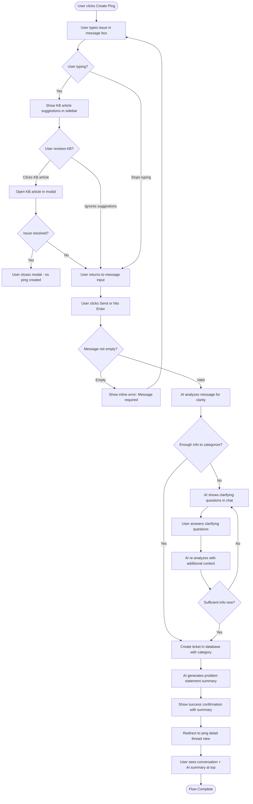
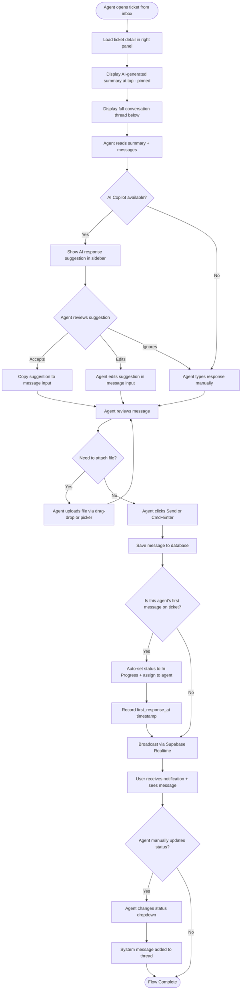
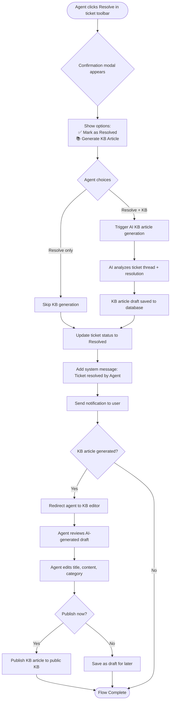
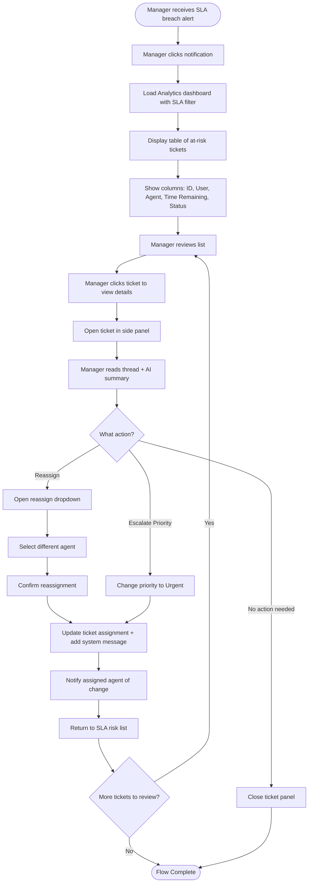

# User Flows

## Flow 1: End User Creates First Ping

**User Goal:** Report an issue and receive help from support team

**Entry Points:**
- "Create Ping" button in sidebar
- Empty state in "My Pings" with prominent CTA
- Direct URL: `/pings/new`

**Success Criteria:**
- Ticket created successfully
- User sees confirmation and their message in thread
- Agent receives ticket in inbox

### Flow Diagram

### Edge Cases & Error Handling:
- **Empty message:** Show inline validation error "Please describe your issue"
- **Network failure during AI analysis:** Show retry button with error message, don't create ticket yet
- **AI analysis timeout (>5s):** Create ticket anyway with category "Needs Review" and flag for agent attention
- **User abandons clarification:** After 2 unanswered clarifying questions, create ticket with partial info and "Needs Clarification" flag
- **KB suggestions timeout:** Hide suggestions, don't block ticket creation flow
- **File attachment during creation:** Upload file first, include in AI analysis context
- **AI asks irrelevant questions:** Provide "Skip and create ticket anyway" option after first clarifying question

**Notes:**

**Conversational Intake Process:**
The ticket creation is now a guided conversation. When the user's initial message lacks detail (e.g., "My computer is broken"), the AI asks targeted clarifying questions:
- "What symptoms are you experiencing?"
- "When did this issue start?"
- "Have you tried restarting your device?"

This ensures tickets have sufficient context before creation, reducing back-and-forth and improving agent efficiency.

**AI Clarification Examples:**
- **Vague:** "Email not working" → AI asks: "Are you unable to send emails, receive them, or both? What error message do you see?"
- **Ambiguous:** "The system is slow" → AI asks: "Which system are you referring to? When does the slowness occur?"
- **Incomplete:** "Can't log in" → AI asks: "Which application are you trying to access? What happens when you try to log in?"

**Escape Hatches:**
- Users can click "Skip questions and create ticket" at any time (creates ticket with "Needs Clarification" category)
- After 3 clarifying question rounds, AI automatically creates ticket to prevent frustration
- KB suggestions remain visible throughout clarification process

**Performance:**
- AI analysis happens in <2 seconds for 95% of cases
- Clarifying questions are single-choice or short text (not essays)
- Previous context is maintained throughout conversation (no repeat questions)

---

## Flow 2: Agent Responds to Ticket with AI Assistance

**User Goal:** Review incoming ticket, understand context, and send helpful response quickly

**Entry Points:**
- Agent clicks ticket from inbox list
- Notification → direct link to ticket
- Cmd+K command palette → search ticket ID

**Success Criteria:**
- Agent understands ticket context quickly (via AI summary)
- Response sent successfully
- User receives realtime notification

### Flow Diagram

### Edge Cases & Error Handling:
- **AI summary fails to generate:** Show message "Summary unavailable" but display full thread
- **AI copilot timeout:** Hide suggestion panel, don't block agent from typing
- **Message send fails:** Show error banner with retry button, preserve message in input
- **File upload fails:** Show inline error under file, allow message send without attachment
- **Realtime connection dropped:** Show warning banner "Updates may be delayed"
- **Agent loses internet mid-typing:** Auto-save draft to localStorage, restore on reconnect

**Notes:**

**Auto-Status Behavior:**
- Agent's first message on a New ticket automatically changes status to "In Progress" and assigns ticket to that agent
- Records `first_response_at` timestamp (stops "First Response Time" SLA timer)
- When user responds and status is "Waiting on User", automatically changes back to "In Progress" (resumes SLA timer)
- Agent can manually set status to "Waiting on User" when asking user to test/provide info (pauses SLA timer)

**AI Copilot:**
- AI Copilot runs asynchronously—suggestions appear within 2-3 seconds but never block the agent
- Typing indicators show to the user when agent is composing
- Cmd+Enter keyboard shortcut sends message

---

## Flow 3: Agent Resolves Ticket and Creates KB Article

**User Goal:** Close ticket as resolved and optionally generate KB article for future self-service

**Entry Points:**
- Agent clicks "Resolve" status in ticket toolbar
- Keyboard shortcut: `Cmd+Shift+R`

**Success Criteria:**
- Ticket marked as resolved
- User notified of resolution
- KB article draft generated (if opted in)
- Agent can review and publish KB article

### Flow Diagram

### Edge Cases & Error Handling:
- **AI KB generation fails:** Show error message "KB article generation failed, you can create one manually"
- **User declines KB generation:** Only resolve ticket, skip KB workflow
- **Agent closes KB editor without publishing:** Auto-save draft, show toast "Draft saved"
- **Network failure during publish:** Show retry button, keep draft safe in database
- **Ticket has insufficient content for KB:** AI returns error, agent notified

**Notes:** KB article generation is opt-in per resolution to avoid noise. Articles are drafted immediately but require agent review before publishing. This ensures quality while reducing agent effort.

---

## Flow 4: Manager Reviews SLA Breach Alert

**User Goal:** Identify tickets at risk of SLA breach and take corrective action

**Entry Points:**
- In-app notification: "3 tickets approaching SLA breach"
- Analytics dashboard: SLA compliance widget shows red indicator
- Email digest: Daily summary of SLA risks

**Success Criteria:**
- Manager identifies at-risk tickets
- Manager reassigns or escalates tickets
- SLA compliance improves

### Flow Diagram

### Edge Cases & Error Handling:
- **No available agents for reassignment:** Show warning "All agents at capacity" with option to escalate
- **SLA policy not configured:** Show setup prompt with link to SLA configuration
- **Ticket resolved while manager reviewing:** Remove from list with success message
- **Manager lacks permission to reassign:** Show error "Contact owner to enable reassignment"
- **Multiple managers reviewing same ticket:** Show presence indicator "Jane is viewing this ticket"

**Notes:** SLA timer is prominent in ticket toolbar for agents and managers. Breached tickets turn red. Notifications are configurable (instant, hourly digest, daily digest). Managers can bulk reassign from table view.
